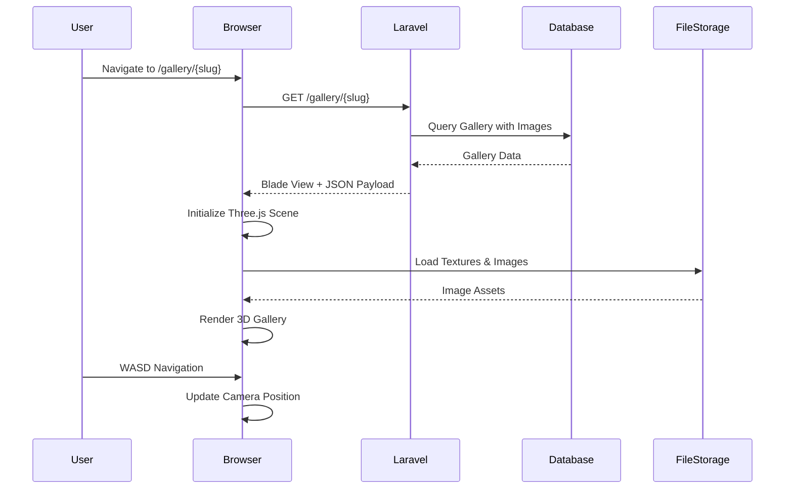
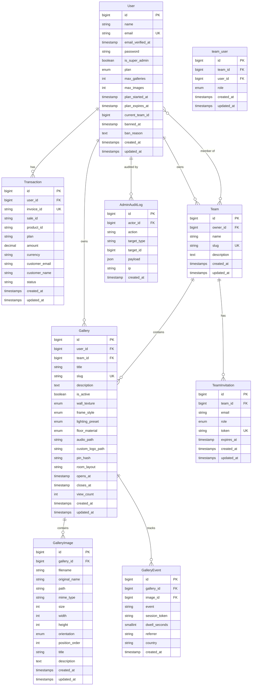
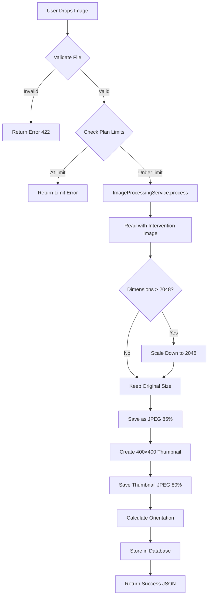

# Exospace 3D Gallery — Technical Documentation

> **Version:** 2.3.0
> **Last Updated:** June 9, 2026
> **Document Type:** Comprehensive Technical Reference

---

## Table of Contents

1. [Project Overview](#project-overview)
2. [Architecture & System Design](#architecture--system-design)
3. [Technology Stack](#technology-stack)
4. [Core Features](#core-features)
5. [Data Model & Database Schema](#data-model--database-schema)
6. [Backend Architecture](#backend-architecture)
7. [3D Rendering Engine](#3d-rendering-engine)
8. [Image Processing Pipeline](#image-processing-pipeline)
9. [User Interface Components](#user-interface-components)
10. [Security Considerations](#security-considerations)
11. [Design Decisions & Rationale](#design-decisions--rationale)
12. [Use Cases](#use-cases)
13. [File Structure Reference](#file-structure-reference)
14. [Deployment & Cloud Hosting](#deployment--cloud-hosting)
15. [API Reference](#api-reference)

---

## Project Overview

### What is Exospace?

**Exospace** is a SaaS web platform that enables users to create immersive, first-person walkable 3D virtual galleries. Users upload their artwork images through an admin panel, and the system automatically generates a fully navigable 3D gallery room rendered in real-time using WebGL. The platform operates on a freemium model with one-time lifetime plan upgrades processed via 2Checkout. Teams allow multiple collaborators to manage galleries together under a shared workspace.

### Purpose & Vision

The platform solves the problem of digital art presentation by transforming static image collections into interactive, museum-like experiences. Key goals include:

- **Accessibility**: No 3D modeling or coding knowledge required
- **Immersion**: First-person navigation with WASD controls mimics real gallery visits
- **Customization**: Configurable wall textures, floor materials, lighting presets, and frame styles
- **Performance**: Optimized for modern browsers without plugins
- **Commerce**: Automated plan management via payment webhooks
- **Collaboration**: Team workspaces for studios, galleries, and agencies

### Target Users

| User Type | Use Case |
|-----------|----------|
| **Artists** | Showcase portfolios in immersive environments |
| **Galleries** | Create virtual exhibitions for remote viewing |
| **Museums** | Digital extensions of physical collections |
| **Educators** | Interactive art history presentations |
| **Photographers** | Premium presentation of photography work |
| **Studios & Agencies** | Collaborate on client galleries as a team |

---

## Architecture & System Design

### High-Level Architecture

```
┌─────────────────────────────────────────────────────────────────────┐
│                         CLIENT (Browser)                             │
├─────────────────────────────────────────────────────────────────────┤
│  ┌─────────────────┐  ┌─────────────────┐  ┌─────────────────────┐  │
│  │   Admin Panel   │  │  Gallery Viewer │  │   Authentication    │  │
│  │  (Blade+Alpine) │  │   (Three.js)    │  │   (Laravel Breeze)  │  │
│  └────────┬────────┘  └────────┬────────┘  └──────────┬──────────┘  │
└───────────┼────────────────────┼─────────────────────┼──────────────┘
            │                    │                     │
            ▼                    ▼                     ▼
┌─────────────────────────────────────────────────────────────────────┐
│                         SERVER (Laravel 12)                          │
├─────────────────────────────────────────────────────────────────────┤
│  ┌─────────────────┐  ┌─────────────────┐  ┌─────────────────────┐  │
│  │   Controllers   │  │    Services     │  │      Models         │  │
│  │  (Admin CRUD)   │  │ (ImageProcess)  │  │ Gallery,User,Team.. │  │
│  └────────┬────────┘  └────────┬────────┘  └──────────┬──────────┘  │
└───────────┼────────────────────┼─────────────────────┼──────────────┘
            │                    │                     │
            ▼                    ▼                     ▼
┌─────────────────────────────────────────────────────────────────────┐
│                      DATA & STORAGE LAYER                            │
├─────────────────────────────────────────────────────────────────────┤
│  ┌─────────────────┐  ┌─────────────────┐  ┌─────────────────────┐  │
│  │   MySQL 8 DB    │  │  File Storage   │  │   Static Assets     │  │
│  │  (Eloquent ORM) │  │  (public/disk)  │  │   (Textures, JS)    │  │
│  └─────────────────┘  └─────────────────┘  └─────────────────────┘  │
└─────────────────────────────────────────────────────────────────────┘
```

### Request Flow


```mermaid
sequenceDiagram
    participant User
    participant Browser
    participant Laravel
    participant Database
    participant FileStorage

    User->>Browser: Navigate to /gallery/{slug}
    Browser->>Laravel: GET /gallery/{slug}
    Laravel->>Database: Query Gallery with Images
    Database-->>Laravel: Gallery Data
    Laravel-->>Browser: Blade View + JSON Payload
    Browser->>Browser: Initialize Three.js Scene
    Browser->>FileStorage: Load Textures & Images
    FileStorage-->>Browser: Image Assets
    Browser->>Browser: Render 3D Gallery
    User->>Browser: WASD Navigation
    Browser->>Browser: Update Camera Position
```

---

## Technology Stack

### Backend Technologies

| Technology | Version | Purpose |
|------------|---------|---------|
| **PHP** | 8.2+ | Server-side language |
| **Laravel** | 12.x | MVC framework |
| **Alpine.js** | 3.4.2 | Reactive UI (dropdowns, toggles, modals) |
| **Laravel Sanctum** | 4.2 | API authentication |
| **Laravel Breeze** | 2.3 | Authentication scaffolding |
| **Intervention Image** | 3.11 | Image processing & manipulation |
| **Spatie Media Library** | 11.17 | Media file management |
| **Resend Laravel** | 1.1 | Transactional email API |

### Frontend Technologies

| Technology | Version | Purpose |
|------------|---------|---------|
| **Three.js** | 0.160.0 | WebGL 3D rendering engine |
| **GSAP** | 3.14.2 | Camera animation in gallery viewer |
| **Alpine.js** | 3.4.2 | Lightweight reactivity for UI components |
| **Tailwind CSS** | 4.x | Utility-first CSS framework |
| **Inter** | Variable | UI typeface (replaces Figtree as of v2.3.0) |
| **Vite** | 7.x | Asset bundling |
| **Axios** | 1.11 | HTTP client |

### Database & Storage

| Component | Technology | Notes |
|-----------|------------|-------|
| **Primary Database** | MySQL 8 (production) | Coolify-managed on DigitalOcean |
| **File Storage** | Laravel Filesystem | `public` disk |
| **Queue Backend** | Database queue | Laravel Queue with `jobs` table |
| **Caching** | File-based | Laravel Cache |
| **Email** | Resend API | Via `resend/resend-laravel` |

### Infrastructure

| Component | Technology | Notes |
|-----------|------------|-------|
| **Hosting** | DigitalOcean | VPS via Coolify |
| **Platform** | Coolify | Self-hosted PaaS |
| **Build System** | Nixpacks | `nixpacks.toml` |
| **Web Server** | Nginx + PHP-FPM | Configured in `docker-start.sh` |
| **Payment Processor** | 2Checkout (Verifone) | One-time purchases |

---

## Core Features

### 1. Gallery Management

**Capability**: Full CRUD operations for virtual galleries with customization options.

| Feature | Description |
|---------|-------------|
| Create Gallery | Title, description, and style configuration |
| Edit Gallery | Update settings and manage images |
| Delete Gallery | Cascade deletion of images |
| Toggle Active | Enable/disable public visibility |
| Analytics | Per-gallery visitor tracking |
| PIN Protection | Optional PIN gate for private galleries |
| Team Assignment | Galleries optionally belong to a team |
| Scheduling | Optional open/close timestamps for time-limited exhibitions |

**Customization Options**:

```php
'wall_texture'    => ['white', 'concrete', 'brick', 'wood']
'frame_style'     => ['modern', 'classic', 'minimal']
'lighting_preset' => ['bright', 'moody', 'dramatic']
'floor_material'  => ['wood', 'marble', 'concrete']
'room_layout'     => ['square', 'corridor', 'l-shape', 'rotunda']
```

### 2. Multi-Tenancy & Team Collaboration

**Capability**: Shared workspaces for collaborative gallery management with role-based access control.

#### Team Structure

```
Team (owner: User)
├── Members (pivot: team_user)
│   ├── owner  — full control, invite/remove, delete team
│   ├── editor — create/edit/delete galleries in the team
│   └── viewer — read-only access to team galleries
├── Galleries (team_id FK)
└── Invitations (pending, token-based, 7-day expiry)
```

#### Team Context Switcher

Users can switch between **Personal** workspace and any team they belong to from the navigation bar. The active context is stored as `current_team_id` on the user. When a team is active:
- The gallery index shows only that team's galleries
- New galleries are assigned to that team
- The active team name is shown in the nav with a green dot indicator

#### Role Permissions

| Action | Owner | Editor | Viewer |
|--------|-------|--------|--------|
| View team galleries | ✅ | ✅ | ✅ |
| Create gallery in team | ✅ | ✅ | ❌ |
| Edit/delete gallery | ✅ | ✅ | ❌ |
| Invite members | ✅ | ❌ | ❌ |
| Change member roles | ✅ | ❌ | ❌ |
| Remove members | ✅ | ❌ | ❌ |
| Edit team settings | ✅ | ❌ | ❌ |
| Delete team | ✅ | ❌ | ❌ |

#### Plan Limits with Teams

The **team owner's plan** governs all team gallery limits and Pro/Studio features. Editors use the owner's quota, not their own. Upgrading the owner to Pro or Studio benefits the entire team.

#### Invitation Flow

```
Owner invites email
    → TeamInvitation row created (token, role, 7-day expiry)
    → TeamInvitationMail sent via Resend queue
    → Invitee clicks /team-invitations/{token}
        → Logged in + matching email → Accept/Decline buttons shown
        → Logged in + wrong email   → Warning + Switch Account (POST logout)
        → Guest                     → Register or Log In links
    → On Accept: user added to team_user pivot, context switched, invite deleted
    → On Decline: invite deleted
    → On Expiry: invitation-expired.blade.php shown
```

**Key design**: No `auth` middleware on invitation POST routes. Auth is handled inside the controller with a proper `redirect()->route('login')` so guests see a redirect instead of a 405 error.

#### Helper Methods

```php
// Team model
$team->isOwner($user);       // bool
$team->hasMember($user);     // bool
$team->canEdit($user);       // owner or editor
$team->memberRole($user);    // 'owner'|'editor'|'viewer'|null

// User model
$user->ownedTeams;           // HasMany
$user->teams;                // BelongsToMany (with pivot role)
$user->currentTeam();        // Team|null
$user->switchTeam($team);    // bool — updates current_team_id
$user->belongsToTeam($team); // bool
$user->teamRole($team);      // 'owner'|'editor'|'viewer'|null
```

### 3. User Subscription System

**Capability**: Tiered access control with automated plan management via 2Checkout.

| Feature | Free | Pro | Studio |
|---------|------|-----|--------|
| Max Galleries | 1 | 5 | Unlimited |
| Max Images/Gallery | 10 | 50 | Unlimited |
| Analytics | ❌ | ✅ | ✅ Advanced |
| Ambient Audio | ❌ | ✅ | ✅ |
| Custom Logo | ❌ | ❌ | ✅ |
| Teams | ✅ | ✅ | ✅ |
| Support | Community | Email | Priority |
| Price | Free | $29 one-time | $99 one-time |

**Plan helpers on `User` model**:

```php
$user->isPro();              // true for pro and studio
$user->canCreateGallery();   // DB-level count check against max_galleries
$user->currentImageCount();  // total images across all personal galleries
$user->isSuperAdmin();       // checks is_super_admin flag
```

### 4. 2Checkout Payment Integration

**Capability**: Fully automated purchase-to-plan-upgrade pipeline with transaction history and replay protection.

**Webhook Endpoints**:

| Endpoint | Handler | Events Handled |
|----------|---------|----------------|
| `POST /webhooks/2checkout` | `WebhookController@handle2Checkout` | `ORDER_CREATED` |
| `POST /webhooks/2checkout/refund` | `WebhookController@handleRefund` | Refunds & cancellations |

**Product ID Map** (configured via environment variables):

```php
$productMap = [
    config('services.2checkout.product_id_pro')    => [
        'plan'          => 'pro',
        'max_galleries' => 5,
        'max_images'    => 50,
    ],
    config('services.2checkout.product_id_studio') => [
        'plan'          => 'studio',
        'max_galleries' => 999,
        'max_images'    => 999,
    ],
];
```

**Security**: Every IPN verified via MD5 hash using `TWOCHECKOUT_SECRET_WORD` before any processing occurs.

**Idempotency**: Before upgrading a user, the handler checks for an existing `completed` transaction with the same `invoice_id`. Duplicate IPNs are logged and discarded. A `UNIQUE` database constraint on `transactions.invoice_id` provides a second safety layer.

**Transaction Storage**: All purchases and refunds written to `transactions` table with full audit trail.

**Required `.env` variables**:

```env
TWOCHECKOUT_ACCOUNT_NUMBER=
TWOCHECKOUT_SECRET_WORD=
TWOCHECKOUT_PRODUCT_ID_PRO=
TWOCHECKOUT_PRODUCT_ID_STUDIO=
```

### 5. Transaction History

**Capability**: Permanent record of all purchases and refunds for accounting and dispute resolution.

| Column | Description |
|--------|-------------|
| `invoice_id` | Unique 2Checkout invoice ID (UNIQUE constraint) |
| `sale_id` | 2Checkout sale reference |
| `product_id` | 2Checkout product ID purchased |
| `plan` | Plan activated (pro / studio) |
| `amount` | Payment amount |
| `currency` | Payment currency (default USD) |
| `customer_email` | Purchaser email |
| `status` | `completed` or `refunded` |

### 6. Email Verification

**Capability**: Mandatory email verification before dashboard access, with queued delivery via Resend.

**Flow**:
1. User registers → `Registered` event fires → verification email queued
2. Welcome email sent separately via `User::booted()` hook
3. User redirected to `/email/verify` notice page
4. User clicks verification link in email → lands on dashboard
5. All admin routes protected by `verified` middleware

**Components**:

| Component | Location |
|-----------|----------|
| `MustVerifyEmail` | `app/Models/User.php` |
| Verification view | `resources/views/auth/verify-email.blade.php` |
| Welcome email | `app/Mail/WelcomeEmail.php` (implements `ShouldQueue`) |
| Email template | `resources/views/emails/welcome.blade.php` |

### 7. Analytics Tracking

**Capability**: Real-time visitor analytics per gallery with event-level granularity.

| Event Type | Description |
|------------|-------------|
| `view` | Gallery opened by a visitor |
| `focus` | Visitor inspected a specific artwork (pressed E) |
| `tour_start` | Guided tour initiated |
| `tour_complete` | Guided tour completed |

**Data Captured per Event**:
- `session_token` — Random UUID per visitor session (no auth required)
- `dwell_seconds` — Time spent (view events)
- `referrer` — Traffic source domain
- `country` — Two-letter country code (via GeoIP, optional)
- `image_id` — For focus events, which artwork was inspected

**Analytics Dashboard** (`/admin/galleries/{gallery}/analytics`):
- Total views and unique visitors (30-day chart)
- Average dwell time
- Top artworks by focus count
- Referrer breakdown

**Rate Limiting**: Analytics tracking endpoint throttled at 120 events per minute per IP.

### 8. PIN-Protected Galleries

**Capability**: Optional PIN gate for private or client-preview galleries.

| Feature | Implementation |
|---------|----------------|
| PIN Setting | Hashed via `Hash::make()` on save |
| PIN Verification | `Gallery::verifyPin()` using `Hash::check()` |
| Session Gate | PIN verified once per session |
| Public URL | Unaffected — PIN only gates entry |

**Database Column**: `galleries.pin_hash` (nullable string)

### 9. Gallery Scheduling (Time-Gate)

**Capability**: Galleries can be configured to automatically open and close at specific timestamps, enforcing time-limited exhibitions.

| Feature | Implementation |
|---------|----------------|
| Open date | `opens_at` timestamp — gallery inaccessible before this time |
| Close date | `closes_at` timestamp — gallery inaccessible after this time |
| Always-open | Both fields NULL = open indefinitely (default) |
| Setting | Configured in gallery create/edit form |

**Model helpers on `Gallery`**:

```php
$gallery->isScheduled();      // bool — has an opens_at set
$gallery->isOpen();           // bool — currently within the open window
$gallery->hasNotOpenedYet();  // bool — opens_at is in the future
$gallery->hasClosed();        // bool — closes_at is in the past
```

**Database columns**: `galleries.opens_at` (TIMESTAMP NULL), `galleries.closes_at` (TIMESTAMP NULL).

### 10. 3D Gallery Viewer

**Capability**: Real-time WebGL-rendered virtual gallery with first-person navigation.

| Feature | Implementation |
|---------|----------------|
| First-Person Controls | PointerLockControls (Three.js) |
| Movement | WASD keys with variable speed (1×/2×/4×/8×) |
| Sprint | Left Shift key |
| Look Around | Mouse movement |
| Artwork Info | Press E to inspect / zoom |
| Collision Detection | Room boundary constraints |
| Mobile | Virtual joystick + look pad |

### 11. Dynamic Lighting System

**Capability**: Proximity-based artwork illumination with cinematic tone mapping.

| Preset | Ambient | Spotlight | Fill Light |
|--------|---------|-----------|------------|
| **Bright** | 0.7 | 1.2 | 0.5 |
| **Moody** | 0.4 | 0.8 | 0.3 |
| **Dramatic** | 0.25 | 1.5 | 0.15 |

Proximity lights activate for artworks within 5 meters. Tone mapping: `ACESFilmicToneMapping` at exposure 0.8.

### 12. Momentum Camera System

**Capability**: Physics-based camera movement with weight, friction, and cinematic banking.

| Parameter | Value | Effect |
|-----------|-------|--------|
| `damping` | 10.0 | Friction / weighted stop |
| `acceleration` | 40.0 m/s² | Smooth ramp-up |
| `maxSpeed` | 3.0 m/s | Top velocity |
| `maxLean` | 0.02 rad | Cinematic tilt into turns |

### 13. Tactile Art System

**Capability**: Realistic canvas texture simulation using normal mapping on all artwork surfaces.

- Normal map applied to `MeshStandardMaterial` (roughness 0.75)
- Smart grain scaling based on artwork dimensions
- Asset: `/assets/textures/shared/canvas_normal.jpg`

### 14. Mobile & Touch Input System

**Capability**: Full mobile compatibility with touch-optimized controls.

| Component | Implementation |
|-----------|----------------|
| Virtual Joystick | On-screen joystick for movement (left thumb) |
| Look Pad | Dedicated area for camera rotation (right thumb) |
| Adaptive UI | Auto-detection disables keyboard hints, shows touch overlays |
| Detection | `navigator.maxTouchPoints` + User-Agent |

### 15. Interactive SFX Engine

**Capability**: Dynamic sound effects for immersion and interaction feedback.

| Feature | Details |
|---------|---------|
| Footsteps | Velocity-based trigger with walk/sprint cadence |
| Pitch Variance | 0.95×–1.05× randomization prevents fatigue |
| UI Acoustics | Focus mode, click feedback |
| Architecture | Audio Listener attached to camera for spatial positioning |

### 16. Ambient Audio System

**Capability**: Optional background music per gallery (Pro plan feature).

| Feature | Implementation |
|---------|----------------|
| Upload | MP3/WAV via gallery edit form |
| Storage | `storage/galleries/{id}/audio/` |
| Playback | HTML5 Audio API, looped |
| Control | Mute/unmute button in viewer UI |

### 17. Studio Branding (Custom Logo)

**Capability**: White-label branding for Studio plan users.

| Feature | Implementation |
|---------|----------------|
| Upload | PNG/JPG/SVG via gallery edit form |
| Storage | `storage/galleries/{id}/logo/` |
| Display | Replaces Exospace logo in gallery viewer header |

### 18. Super Admin Panel

**Capability**: Platform-wide administration accessible at `/master-control`. All write actions are recorded in `admin_audit_logs`.

| Feature | Description |
|---------|-------------|
| User List | All users paginated (50/page) with plan and gallery counts |
| Plan Management | Upgrade/downgrade any user's plan |
| User Deletion | Cascade delete with full file cleanup |
| Gallery Oversight | View and toggle any gallery's active status |
| Platform Stats | Users by plan, total galleries, images, views, banned users, unverified users |
| Ban / Unban | Suspend accounts with a reason; banned users are logged out immediately |
| Email Verify / Unverify | Manually grant or revoke email verification for support escalations |
| Toggle Super Admin | Grant or revoke super-admin privileges |
| Audit Log | Every write action recorded in `admin_audit_logs` |

**Access Control**: `is_super_admin` boolean on `users` table, protected by `EnsureUserIsSuperAdmin` middleware. Super-admin routes also require `verified` middleware.

**Self-action protection**: All destructive actions call `preventSelfAction()` — super-admins cannot ban, delete, or demote themselves.

### 19. User Account Moderation

**Capability**: Full account lifecycle controls for suspended or problematic accounts.

| Action | Implementation |
|--------|----------------|
| Ban | Sets `banned_at` + `ban_reason` on user; session invalidated on next request |
| Unban | Clears `banned_at` and `ban_reason`; user can log in again |
| Email verify | Manually marks `email_verified_at` — unblocks access without re-verification |
| Email unverify | Clears `email_verified_at` — restricts access without deleting the account |
| Toggle super-admin | Flips `is_super_admin` boolean |

**`CheckBanned` middleware** runs globally on every request. When a banned user makes a request, their session is invalidated, they are logged out, and they are redirected to the login page with an error message showing the ban reason.

**Database columns on `users`**: `banned_at` (TIMESTAMP NULL), `ban_reason` (TEXT NULL).

### 20. Admin Audit Log

**Capability**: Append-only record of every privileged super-admin action for compliance and forensics.

| Column | Description |
|--------|-------------|
| `actor_id` | Super-admin user who performed the action |
| `action` | Machine-readable name (e.g. `plan_changed`, `user_banned`) |
| `target_type` / `target_id` | Polymorphic reference to the affected record |
| `payload` | JSON before/after state or contextual data |
| `ip` | IP address of the actor at time of action |
| `created_at` | Timestamp (no `updated_at` — records are immutable) |

**Recorded actions**: `plan_changed`, `user_banned`, `user_unbanned`, `super_admin_toggled`, `user_deleted`, `email_verified` (manual), `email_unverified`.

**Usage**:

```php
AdminAuditLog::record('plan_changed', $user, [
    'from' => $user->getOriginal('plan'),
    'to'   => $plan,
]);
```

**Location**: `app/Models/AdminAuditLog.php`

### 21. Plan Expiry Enforcement

**Capability**: Automatic real-time downgrade of users whose paid plan has expired.

**Middleware**: `CheckPlanExpiry` runs on every authenticated request. If `plan_expires_at` is non-null and in the past, the user is immediately downgraded to the Free plan (1 gallery, 10 images) before the request continues.

- JSON requests receive `402 Payment Required` with an error message.
- Web requests are redirected to the gallery index with a flash warning.
- The check is skipped for `free` plan users and when `plan_expires_at` is NULL (lifetime purchases).

**Location**: `app/Http/Middleware/CheckPlanExpiry.php`

### 22. Security Headers

**Capability**: Global middleware enforcing security best practices on all HTTP responses.

| Header | Value | Purpose |
|--------|-------|---------|
| `X-Frame-Options` | `DENY` | Prevents clickjacking |
| `Strict-Transport-Security` | `max-age=31536000; includeSubDomains` | Forces HTTPS for 1 year |
| `X-Content-Type-Options` | `nosniff` | Blocks MIME sniffing |
| `X-Permitted-Cross-Domain-Policies` | `none` | Restricts cross-domain access |
| `Referrer-Policy` | `strict-origin-when-cross-origin` | Controls referrer sharing |

**Implementation**: `app/Http/Middleware/SecurityHeaders.php` registered globally in `bootstrap/app.php`.

### 23. Cookie Consent Banner

**Capability**: GDPR-compliant cookie consent with user preference persistence.

| Feature | Implementation |
|---------|----------------|
| UI | Fixed bottom banner with Accept/Decline |
| Storage | Browser cookie `exospace_cookie_consent` (365-day expiry) |
| Reactivity | Alpine.js with fade-in animation |
| Location | `resources/views/layouts/partials/cookie-banner.blade.php` |

### 24. Legal & Compliance Pages

**Capability**: Full legal page suite required for 2Checkout merchant approval and regulatory compliance.

| Page | Route | Description |
|------|-------|-------------|
| Privacy Policy | `/privacy` | Data collection, usage, and protection |
| Terms of Service | `/terms` | User agreement, one-time purchase terms |
| Refund Policy | `/refund-policy` | 14-day money-back guarantee |
| Payment Security | `/payment-security` | PCI DSS, SSL, 2Checkout data handling |
| About Us | `/about` | Company story, mission, registered address |
| Contact Us | `/contact` | Support and sales inquiry form (real delivery via Resend) |
| Pricing | `/pricing` | Plan comparison with live checkout modals |

All pages reflect the one-time lifetime purchase model — no subscription or auto-renewal language.

### 25. Email Queue System

**Capability**: Asynchronous email delivery via Resend API.

| Component | Implementation |
|-----------|----------------|
| Provider | Resend API (`resend/resend-laravel`) |
| Queue Backend | `database` driver |
| Welcome Email | `App\Mail\WelcomeEmail` (implements `ShouldQueue`) |
| Team Invitation Email | `App\Mail\TeamInvitationMail` (implements `Queueable`) |
| Contact Form | `ContactController` sends synchronously via `Mail::raw()` |
| Template | `resources/views/emails/welcome.blade.php` |
| Template | `resources/views/emails/team-invitation.blade.php` |

**Queue Worker** (runs on startup via `docker-start.sh`):
```bash
php artisan queue:work --tries=3 --timeout=90 --sleep=3 &
```

### 26. Gallery Sharing & Demo

| Feature | Implementation |
|---------|----------------|
| Share Modal | Copy-to-clipboard URL in admin gallery list |
| Demo URL | `/gallery/demo` redirects to first active gallery |
| Fallback | Homepage with error if no galleries exist |

### 27. Artwork Focus Mode

**Capability**: Cinematic zoom-in for detailed artwork viewing.

| Feature | Implementation |
|---------|----------------|
| Activation | Press E while looking at artwork |
| Animation | GSAP smooth camera transition (1.5s in, 1.2s out) |
| Movement Lock | Player movement disabled during focus |
| Exit | Press E again or ESC |

---

## Data Model & Database Schema

### Entity Relationship Diagram


```mermaid
erDiagram
    User ||--o{ Gallery : owns
    User ||--o{ Transaction : has
    User ||--o{ Team : owns
    User }o--o{ Team : "member of"
    User ||--o{ AdminAuditLog : "audited by"
    Team ||--o{ Gallery : contains
    Team ||--o{ TeamInvitation : has
    Gallery ||--o{ GalleryImage : contains
    Gallery ||--o{ GalleryEvent : tracks

    User {
        bigint id PK
        string name
        string email UK
        timestamp email_verified_at
        string password
        boolean is_super_admin
        enum plan
        int max_galleries
        int max_images
        timestamp plan_started_at
        timestamp plan_expires_at
        bigint current_team_id
        timestamp banned_at
        text ban_reason
        timestamps created_at
        timestamps updated_at
    }

    Team {
        bigint id PK
        bigint owner_id FK
        string name
        string slug UK
        text description
        timestamps created_at
        timestamps updated_at
    }

    team_user {
        bigint id PK
        bigint team_id FK
        bigint user_id FK
        enum role
        timestamps created_at
        timestamps updated_at
    }

    TeamInvitation {
        bigint id PK
        bigint team_id FK
        string email
        enum role
        string token UK
        timestamp expires_at
        timestamps created_at
        timestamps updated_at
    }

    Gallery {
        bigint id PK
        bigint user_id FK
        bigint team_id FK
        string title
        string slug UK
        text description
        boolean is_active
        enum wall_texture
        enum frame_style
        enum lighting_preset
        enum floor_material
        string audio_path
        string custom_logo_path
        string pin_hash
        string room_layout
        timestamp opens_at
        timestamp closes_at
        int view_count
        timestamps created_at
        timestamps updated_at
    }

    GalleryImage {
        bigint id PK
        bigint gallery_id FK
        string filename
        string original_name
        string path
        string mime_type
        int size
        int width
        int height
        enum orientation
        int position_order
        string title
        text description
        timestamps created_at
        timestamps updated_at
    }

    GalleryEvent {
        bigint id PK
        bigint gallery_id FK
        bigint image_id FK
        string event
        string session_token
        smallint dwell_seconds
        string referrer
        string country
        timestamp created_at
    }

    Transaction {
        bigint id PK
        bigint user_id FK
        string invoice_id UK
        string sale_id
        string product_id
        string plan
        decimal amount
        string currency
        string customer_email
        string customer_name
        string status
        timestamps created_at
        timestamps updated_at
    }

    AdminAuditLog {
        bigint id PK
        bigint actor_id FK
        string action
        string target_type
        bigint target_id
        json payload
        string ip
        timestamp created_at
    }
```

### Table: `users`

| Column | Type | Default | Description |
|--------|------|---------|-------------|
| `id` | BIGINT PK | auto | Primary key |
| `name` | VARCHAR(255) | — | User's full name |
| `email` | VARCHAR(255) UNIQUE | — | Login email |
| `email_verified_at` | TIMESTAMP | NULL | Verification timestamp |
| `is_super_admin` | BOOLEAN INDEXED | false | Platform admin flag |
| `password` | VARCHAR(255) | — | Bcrypt hash |
| `plan` | ENUM | `free` | free / pro / studio |
| `max_galleries` | INT UNSIGNED | 1 | Gallery creation limit |
| `max_images` | INT UNSIGNED | 10 | Images per gallery limit |
| `plan_started_at` | TIMESTAMP | NULL | Plan activation date |
| `plan_expires_at` | TIMESTAMP | NULL | NULL = lifetime |
| `current_team_id` | BIGINT UNSIGNED | NULL | Active team context |
| `banned_at` | TIMESTAMP | NULL | NULL = active; non-null = banned |
| `ban_reason` | TEXT | NULL | Human-readable ban reason |
| `created_at` / `updated_at` | TIMESTAMP | — | Eloquent timestamps |

### Table: `teams`

| Column | Type | Default | Description |
|--------|------|---------|-------------|
| `id` | BIGINT PK | auto | Primary key |
| `owner_id` | BIGINT FK | — | References `users.id` (cascade delete) |
| `name` | VARCHAR(100) | — | Team display name |
| `slug` | VARCHAR(255) UNIQUE | — | Auto-generated URL-safe identifier |
| `description` | TEXT | NULL | Optional team description |
| `created_at` / `updated_at` | TIMESTAMP | — | Eloquent timestamps |

### Table: `team_user` (pivot)

| Column | Type | Default | Description |
|--------|------|---------|-------------|
| `id` | BIGINT PK | auto | Primary key |
| `team_id` | BIGINT FK | — | References `teams.id` (cascade delete) |
| `user_id` | BIGINT FK | — | References `users.id` (cascade delete) |
| `role` | ENUM | `viewer` | owner / editor / viewer |
| `created_at` / `updated_at` | TIMESTAMP | — | Eloquent timestamps |

**Unique constraint**: `(team_id, user_id)`

### Table: `team_invitations`

| Column | Type | Default | Description |
|--------|------|---------|-------------|
| `id` | BIGINT PK | auto | Primary key |
| `team_id` | BIGINT FK | — | References `teams.id` (cascade delete) |
| `email` | VARCHAR(255) | — | Invited email address |
| `role` | ENUM | `viewer` | editor / viewer |
| `token` | VARCHAR(64) UNIQUE | — | Secure random token for email link |
| `expires_at` | TIMESTAMP | — | Invitation expiry (7 days from creation) |
| `created_at` / `updated_at` | TIMESTAMP | — | Eloquent timestamps |

**Unique constraint**: `(team_id, email)` — prevents duplicate invites; re-inviting resets the token and expiry via `updateOrCreate`.

### Table: `galleries`

| Column | Type | Default | Description |
|--------|------|---------|-------------|
| `id` | BIGINT PK | auto | Primary key |
| `user_id` | BIGINT FK | — | Creator (always set) |
| `team_id` | BIGINT FK | NULL | Owning team (NULL = personal gallery) |
| `title` | VARCHAR(255) | — | Gallery name |
| `slug` | VARCHAR(255) UNIQUE | — | URL-safe identifier (auto-generated) |
| `description` | TEXT | NULL | Gallery description |
| `is_active` | BOOLEAN | true | Public visibility toggle |
| `wall_texture` | ENUM | `white` | Wall material |
| `frame_style` | ENUM | `modern` | Frame appearance |
| `lighting_preset` | ENUM | `bright` | Light configuration |
| `floor_material` | ENUM | `wood` | Floor texture |
| `audio_path` | VARCHAR(500) | NULL | Ambient audio file path |
| `custom_logo_path` | VARCHAR(500) | NULL | Branding logo path |
| `pin_hash` | VARCHAR(255) | NULL | Hashed PIN (nullable = open) |
| `room_layout` | ENUM | `square` | square / corridor / l-shape / rotunda |
| `opens_at` | TIMESTAMP | NULL | Gallery opens at this time (NULL = always open) |
| `closes_at` | TIMESTAMP | NULL | Gallery closes at this time (NULL = never closes) |
| `view_count` | INT UNSIGNED | 0 | Total view counter |
| `created_at` / `updated_at` | TIMESTAMP | — | Eloquent timestamps |

### Table: `gallery_images`

| Column | Type | Default | Description |
|--------|------|---------|-------------|
| `id` | BIGINT PK | auto | Primary key |
| `gallery_id` | BIGINT FK | — | Parent gallery |
| `filename` | VARCHAR(255) | — | Processed filename |
| `original_name` | VARCHAR(255) | — | Original upload name |
| `path` | VARCHAR(500) | — | Storage path |
| `mime_type` | VARCHAR(100) | — | File MIME type |
| `size` | INT UNSIGNED | — | File size in bytes |
| `width` / `height` | INT UNSIGNED | — | Image dimensions (px) |
| `orientation` | ENUM | — | portrait / landscape / square |
| `position_order` | INT UNSIGNED | 0 | Display order |
| `title` | VARCHAR(255) | NULL | Artwork title |
| `description` | TEXT | NULL | Artwork description |

### Table: `gallery_events`

| Column | Type | Description |
|--------|------|-------------|
| `id` | BIGINT PK | Primary key |
| `gallery_id` | BIGINT FK | Parent gallery |
| `image_id` | BIGINT FK NULL | Artwork (for focus events) |
| `event` | VARCHAR(32) INDEXED | view / focus / tour_start / tour_complete |
| `session_token` | VARCHAR(64) INDEXED | Anonymous visitor session UUID |
| `dwell_seconds` | SMALLINT UNSIGNED NULL | Time on page |
| `referrer` | VARCHAR(255) NULL | Traffic source domain |
| `country` | VARCHAR(2) NULL | ISO country code |
| `created_at` | TIMESTAMP INDEXED | Event time |

### Table: `transactions`

| Column | Type | Description |
|--------|------|-------------|
| `id` | BIGINT PK | Primary key |
| `user_id` | BIGINT FK INDEXED | Purchasing user |
| `invoice_id` | VARCHAR UNIQUE | 2Checkout invoice ID (unique — prevents duplicate processing) |
| `sale_id` | VARCHAR NULL | 2Checkout sale reference |
| `product_id` | VARCHAR NULL | 2Checkout product ID |
| `plan` | VARCHAR | Plan purchased (pro / studio) |
| `amount` | DECIMAL(10,2) | Payment amount |
| `currency` | VARCHAR(10) | Payment currency |
| `customer_email` | VARCHAR INDEXED | Purchaser email |
| `customer_name` | VARCHAR NULL | Purchaser name |
| `status` | VARCHAR INDEXED | completed / refunded |
| `created_at` / `updated_at` | TIMESTAMP | Eloquent timestamps |

### Table: `admin_audit_logs`

| Column | Type | Description |
|--------|------|-------------|
| `id` | BIGINT PK | Primary key |
| `actor_id` | BIGINT FK INDEXED | Super-admin who performed the action |
| `action` | VARCHAR(64) INDEXED | Action name (e.g. `plan_changed`, `user_banned`) |
| `target_type` | VARCHAR(255) | Polymorphic class name of affected model |
| `target_id` | BIGINT UNSIGNED | ID of affected record |
| `payload` | JSON NULL | Contextual data (before/after state, reason, etc.) |
| `ip` | VARCHAR(45) NULL | Actor's IP address |
| `created_at` | TIMESTAMP INDEXED | Event timestamp (append-only — no `updated_at`) |

---

## Backend Architecture

### Controller Structure

```
app/Http/Controllers/
├── Admin/
│   ├── AnalyticsController.php    # Gallery analytics dashboard (team-aware auth)
│   ├── DashboardController.php    # Admin home
│   ├── GalleryController.php      # Gallery CRUD + team scoping + audio/logo upload
│   ├── ImageController.php        # Image upload/delete/reorder (team-aware auth)
│   └── TeamController.php         # Team CRUD, invite, member management
├── Auth/                          # Laravel Breeze controllers
├── SuperAdmin/
│   └── SystemController.php       # Platform-wide administration + audit logging
├── ContactController.php          # Contact form with Resend delivery
├── GalleryPinController.php       # PIN gate show + verify
├── GalleryViewController.php      # Public gallery display
├── InstallerController.php        # First-run setup
├── ProfileController.php          # User profile management
├── TeamInvitationController.php   # Token-based invitation accept/decline
└── WebhookController.php          # 2Checkout IPN + refund handler (idempotent)
```

### Middleware Stack

Registered globally in `bootstrap/app.php` in this order:

| Middleware | Class | Purpose |
|-----------|-------|---------|
| Security Headers | `SecurityHeaders` | Injects HTTP security headers on every response |
| Ban Check | `CheckBanned` | Logs out banned users and redirects to login with reason |
| Plan Expiry | `CheckPlanExpiry` | Auto-downgrades users with expired paid plans |
| Trust Proxies | (built-in) | Trusts all proxy headers (Coolify reverse proxy) |

Named alias:

| Alias | Class | Usage |
|-------|-------|-------|
| `super_admin` | `EnsureUserIsSuperAdmin` | Applied to all `/master-control` routes |

### Route Definitions

```php
// Public Routes
Route::get('/gallery/{slug}', [GalleryViewController::class, 'show']);
Route::get('/gallery/{slug}/pin', [GalleryPinController::class, 'show']);
Route::post('/gallery/{slug}/pin', [GalleryPinController::class, 'verify']);
Route::post('/gallery/{gallery}/track', [AnalyticsController::class, 'track'])
    ->middleware('throttle:120,1');
Route::post('/contact', [ContactController::class, 'submit'])
    ->middleware('throttle:5,10');

// Webhook Routes (no auth)
Route::post('/webhooks/2checkout', [WebhookController::class, 'handle2Checkout']);
Route::post('/webhooks/2checkout/refund', [WebhookController::class, 'handleRefund']);

// Team Invitation Routes (no auth middleware — controller handles redirect)
Route::get('/team-invitations/{token}', [TeamInvitationController::class, 'show']);
Route::post('/team-invitations/{token}/accept', [TeamInvitationController::class, 'accept']);
Route::post('/team-invitations/{token}/decline', [TeamInvitationController::class, 'decline']);

// Admin Routes (auth + verified required)
Route::middleware(['auth', 'verified'])->prefix('admin')->group(function () {
    Route::resource('galleries', GalleryController::class);
    Route::post('galleries/{gallery}/upload-audio', ...);
    Route::post('galleries/{gallery}/upload-logo', ...);
    Route::post('galleries/{gallery}/reorder-images', ...);
    Route::get('galleries/{gallery}/analytics', [AnalyticsController::class, 'show']);
    Route::post('galleries/{gallery}/images', [ImageController::class, 'store'])
        ->middleware('throttle:30,1');
    Route::delete('images/{image}', [ImageController::class, 'destroy']);
    Route::post('images/bulk-delete', [ImageController::class, 'bulkDestroy']);

    // Teams — switch-personal MUST be before {team} routes
    Route::get('teams', [TeamController::class, 'index']);
    Route::get('teams/create', [TeamController::class, 'create']);
    Route::post('teams', [TeamController::class, 'store']);
    Route::post('teams/switch-personal', fn() => ...)->name('teams.switch-personal');
    Route::get('teams/{team}', [TeamController::class, 'show']);
    Route::patch('teams/{team}', [TeamController::class, 'update']);
    Route::delete('teams/{team}', [TeamController::class, 'destroy']);
    Route::post('teams/{team}/invite', [TeamController::class, 'invite']);
    Route::delete('teams/{team}/invitations/{invitation}', [TeamController::class, 'revokeInvitation']);
    Route::delete('teams/{team}/members', [TeamController::class, 'removeMember']);
    Route::patch('teams/{team}/members/role', [TeamController::class, 'updateMemberRole']);
    Route::delete('teams/{team}/leave', [TeamController::class, 'leave']);
    Route::post('teams/{team}/switch', [TeamController::class, 'switchTeam']);
});

// Auth Routes (throttled)
// POST /login          → throttle:5,1
// POST /register       → throttle:10,1

// Super Admin Routes
Route::middleware(['auth', 'verified', 'super_admin'])->prefix('master-control')->group(function () {
    Route::get('/', [SystemController::class, 'index']);
    Route::post('/users/{user}/plan', [SystemController::class, 'updatePlan']);
    Route::delete('/users/{user}', [SystemController::class, 'deleteUser']);
    Route::get('/users/{user}/galleries', [SystemController::class, 'userGalleries']);
    Route::post('/galleries/{gallery}/toggle', [SystemController::class, 'toggleGallery']);
    Route::post('/users/{user}/ban', [SystemController::class, 'banUser']);
    Route::post('/users/{user}/unban', [SystemController::class, 'unbanUser']);
    Route::post('/users/{user}/verify-email', [SystemController::class, 'verifyEmail']);
    Route::post('/users/{user}/unverify-email', [SystemController::class, 'unverifyEmail']);
    Route::post('/users/{user}/toggle-super-admin', [SystemController::class, 'toggleSuperAdmin']);
});
```

> **Important**: `teams/switch-personal` must be declared before `teams/{team}` so Laravel doesn't interpret the literal string `switch-personal` as a `{team}` model binding ID.

### Service Layer

**`ImageProcessingService`** handles all image manipulation:

```php
class ImageProcessingService
{
    public function process(UploadedFile $file, int $galleryId): array
    {
        // 1. Generate unique filename
        // 2. Create storage directories
        // 3. Resize to max 2048×2048 (WebGL texture limit)
        // 4. Generate 400×400 thumbnail
        // 5. Save as JPEG (85% quality main, 80% thumbnail)
        // 6. Return metadata array
    }

    public function delete(string $path): void
    {
        // Delete main image and associated thumbnail
    }
}
```

---

## 3D Rendering Engine

### GalleryScene Class

The core 3D engine (`view.blade.php`) implements a complete WebGL gallery system:

```javascript
class GalleryScene {
    constructor() {
        this.scene    = new THREE.Scene();
        this.camera   = new THREE.PerspectiveCamera(75, aspect, 0.1, 100);
        this.renderer = new THREE.WebGLRenderer({ antialias: true });
        this.controls = new PointerLockControls(this.camera, document.body);
    }
}
```

### Configuration Constants

```javascript
const CONFIG = {
    camera: {
        fov: 75, near: 0.1, far: 100, height: 1.6,
        damping: 10.0, acceleration: 40.0, maxSpeed: 3.0, maxLean: 0.02
    },
    movement: {
        baseSpeed: 0.1,
        speedMultipliers: [1, 2, 4, 8],
        sprintMultiplier: 1.5
    },
    room: {
        wallHeight: 4, artworkSpacing: 3.5,
        minWallLength: 8, wallDepth: 0.3
    },
    lighting: { proximityDistance: 5 }
};
```

### Rendering Pipeline

```
1. Asset Loading
   ├── Wall Texture (configured type)
   ├── Floor Texture (configured type)
   └── Artwork Images (async parallel)

2. Scene Construction
   ├── Room Geometry (floor, 4 walls, ceiling)
   ├── Artwork Placement (calculated per wall)
   └── Lighting Setup (ambient, hemisphere, directional, proximity points)

3. Animation Loop (60 FPS target)
   ├── updateMovement()           # WASD + collision + physics
   ├── updateProximityLighting()  # Dynamic spotlight activation
   ├── checkArtworkFocus()        # Raycasting for E key
   ├── updateAudio()              # Footstep + SFX logic
   └── renderer.render()          # Draw frame
```

### Visual Atmosphere

```javascript
// Depth fog
this.scene.fog = new THREE.Fog(0x0a0a0a, 10, 30);

// Cinematic tone mapping
this.renderer.toneMapping = THREE.ACESFilmicToneMapping;
this.renderer.toneMappingExposure = 0.8;
this.renderer.outputColorSpace = THREE.SRGBColorSpace;
```

---

## Image Processing Pipeline

### Upload Flow


```mermaid
flowchart TD
    A[User Drops Image] --> B{Validate File}
    B -->|Invalid| C[Return Error 422]
    B -->|Valid| D{Check Plan Limits}
    D -->|At limit| E[Return Limit Error]
    D -->|Under limit| F[ImageProcessingService.process]
    F --> G[Read with Intervention Image]
    G --> H{Dimensions > 2048?}
    H -->|Yes| I[Scale Down to 2048]
    H -->|No| J[Keep Original Size]
    I --> J
    J --> K[Save as JPEG 85%]
    K --> L[Create 400×400 Thumbnail]
    L --> M[Save Thumbnail JPEG 80%]
    M --> N[Calculate Orientation]
    N --> O[Store in Database]
    O --> P[Return Success JSON]
```

### Validation Rules

```php
$validator = Validator::make($request->all(), [
    'file' => 'required|file|image|mimes:jpeg,png,jpg,webp|max:10240'
]);
```

### Plan Limit Checks

Two limits are enforced on every upload:

1. **Per-gallery limit**: `$gallery->images()->count()` vs `$user->max_images`
2. **Cross-gallery total**: `DB::table('gallery_images')->join('galleries'...)->where('user_id')` vs `$user->max_images`

Both checks use direct `DB::table()` queries to avoid Eloquent cache and race conditions during concurrent uploads.

### Storage Structure

```
storage/app/public/
└── galleries/
    └── {gallery_id}/
        ├── abc123.jpg           # Main image (max 2048×2048, JPEG 85%)
        └── thumbnails/
            └── abc123.jpg       # Thumbnail (400×400, JPEG 80%)
```

---

## User Interface Components

The admin panel uses a shared Blade component library (`resources/views/components/`) and a set of dashboard-specific components (`resources/views/components/dashboard/`). All components are dark-themed using Tailwind CSS. As of v2.3.0 the typeface is **Inter** loaded from Bunny Fonts.

### Layout & Shell

| Component / File | Purpose |
|------------------|---------|
| `layouts/app.blade.php` | Authenticated app shell — nav, page-in animation, toast system, keyboard shortcuts, modal helpers |
| `layouts/guest.blade.php` | Unauthenticated shell — split-pane with feature sidebar on desktop, auth card on right |
| `layouts/navigation.blade.php` | Top nav — logo, nav links with icons, team context switcher, user menu |
| `layouts/partials/cookie-banner.blade.php` | GDPR cookie consent, Alpine.js, 365-day cookie |
| `layouts/partials/footer.blade.php` | Shared marketing footer |

### Core Components

| Component | Props / Notes |
|-----------|--------------|
| `primary-button` | Submit/CTA button. Gradient purple→indigo, `text-sm`, sentence case, press scale, purple shadow. |
| `secondary-button` | Secondary action. Dark background, `text-sm`, sentence case, press scale, `hover:text-white`. |
| `text-input` | Form text/email/password input. `bg-gray-800/80`, `hover:border-gray-500` pre-focus state, wider focus ring. |
| `input-label` | Form field label. `text-gray-300 font-medium text-sm mb-1` (implicit bottom margin). |
| `input-error` | Inline validation error message. |
| `nav-link` | Desktop nav link. Active = `font-semibold text-white border-b-2 border-purple-400`. Inactive = `text-gray-400`. |
| `responsive-nav-link` | Mobile nav link. |
| `dropdown` | Alpine.js dropdown wrapper with `rounded-xl border border-gray-700 shadow-2xl` panel. |
| `dropdown-link` | Row inside a dropdown. `flex items-center`, `hover:bg-white/[0.04]`, `py-2.5`. |
| `modal` | Base modal wrapper. |
| `upgrade-modal` | Plan upgrade prompt modal (`id="upgrade-modal"`). Call `openModal('upgrade-modal')` or `showUpgradeModal()`. |
| `application-logo` | SVG logo mark. |
| `auth-session-status` | Flash status message on auth pages. |
| `danger-button` | Destructive action button (red). |

### Dashboard Components (`components/dashboard/`)

| Component | Props | Purpose |
|-----------|-------|---------|
| `stat-card` | `label`, `value`, `icon` (SVG path), `color`, `trend` (int %), `trendLabel`, `sub`, `subColor`, `href`, `badge` | KPI card with coloured icon, value, trend indicator, and optional accent line. Supports `href` to render as `<a>`. |
| `card` | `title`, `action` (`[label, href]`), `padding`, `noBorder` | Content card container with optional titled header and action link. |
| `gallery-row` | `gallery` (Eloquent), `stale` (bool) | Single gallery row for the dashboard list — thumbnail, title, status dot, health flags (no images, no views), image count, view count, age. |
| `quick-action` | `href`, `icon` (SVG path), `label`, `description`, `color`, `disabled` | Small icon+label tile for the dashboard quick-action grid. Six colour variants. Disabled state. |
| `sparkline` | `data` (Collection), `label`, `today`, `trend`, `href` | SVG bar chart for the 7-day views sparkline. Renders entirely server-side in Blade. |
| `alert-banner` | `type` (`info`/`warning`/`error`/`success`/`upgrade`), `icon`, `text`, `action`, `dismissKey` | Contextual inline alert strip. Optional dismiss via localStorage key. |

### CSS Design Tokens (`resources/css/app.css`)

Defined in `@layer components`:

```css
/* Buttons */
.btn          /* base: flex, gap, rounded-lg, font-semibold, transitions, focus ring */
.btn-primary  /* gradient purple→indigo, white text, purple shadow */
.btn-ghost    /* dark background, gray border */

/* Card */
.card         /* bg-gray-800 rounded-xl border border-gray-700/60 */

/* Input */
.input-base   /* bg-gray-800, gray border, purple focus */

/* Badges */
.badge        /* base badge shell */
.badge-success / .badge-warn / .badge-neutral / .badge-pro

/* Layout helpers */
.table-row-base   /* border-b border-gray-700/50 + subtle hover */
.section-header   /* text-xs font-semibold text-gray-500 uppercase tracking-wider */
.action-link      /* text-gray-400 hover:text-white transition font-medium text-sm */
.empty-state      /* flex flex-col items-center justify-center py-16 text-center */
```

### Global JavaScript (inlined in `app.blade.php`)

| Utility | Description |
|---------|-------------|
| `window.toast(message, type)` | Shows a toast notification. Types: `success`, `error`, `info`. Auto-dismisses after 3.5s. Reads Laravel flash sessions (`success`, `error`, `info`, `status`, `warning`) on page load. |
| `openModal(id)` / `closeModal(id)` | Show/hide a modal element by ID. Backdrop click and Escape key auto-close all dialogs. |
| `showUpgradeModal()` | Alias for `openModal('upgrade-modal')`. |
| Keyboard shortcuts | `g d` → Dashboard, `g l` → Galleries, `g n` → New Gallery. Ignored when focus is on an input or textarea. |

### App Shell Animations & Utilities (inlined CSS)

| Class / Selector | Effect |
|------------------|--------|
| `.page-content` | `pageIn` fade-up animation (0.25s, ease-out) on every page load |
| `.skeleton` | Shimmer animation for loading placeholders |
| `.card-lift` | `translateY(-2px)` + purple glow on hover |
| `[data-tooltip]` | CSS-only tooltip via `::after` pseudo-element reading `data-tooltip` attribute |
| `.progress-fill` | Smooth width transition for progress bars (`0.8s cubic-bezier`) |
| `@media (prefers-reduced-motion)` | All animations reduced to 0.01ms |

---

## Security Considerations

### Authentication & Authorization

| Layer | Implementation |
|-------|----------------|
| Authentication | Laravel Breeze (session-based) |
| Email Verification | `MustVerifyEmail` on `User` model |
| Password Hashing | Bcrypt (12 rounds) |
| CSRF Protection | Automatic via `@csrf` directive |
| Route Protection | `auth` + `verified` middleware stack |

### Gallery & Team Authorization

All controllers use a consistent pattern. Personal galleries verify ownership; team galleries verify membership and role:

```php
// Used in GalleryController, ImageController, and AnalyticsController:
if ($gallery->team_id) {
    if (! $user->belongsToTeam($gallery->team)) abort(403);
    if ($requireEdit && ! $gallery->team->canEdit($user)) abort(403);
} else {
    if ($gallery->user_id !== $user->id) abort(403);
}
```

Team management actions verify ownership:

```php
// Only owners can invite, remove members, change roles, delete team
if (! $team->isOwner(Auth::user())) {
    abort(403, 'Only the team owner can perform this action.');
}
```

### Rate Limiting

| Endpoint | Limit | Window |
|----------|-------|--------|
| `POST /login` | 5 requests | 1 minute |
| `POST /register` | 10 requests | 1 minute |
| `POST /admin/galleries/{id}/images` | 30 requests | 1 minute |
| `POST /gallery/{gallery}/track` | 120 requests | 1 minute |
| `POST /contact` | 5 requests | 10 minutes |

### Invitation Security

- Tokens are 64-character cryptographically random strings (`Str::random(64)`)
- Tokens expire after 7 days
- Email matching enforced on accept — wrong-account warning shown
- No `auth` middleware on invitation routes (prevents 405); auth checked inside controller

### Webhook Security & Idempotency

2Checkout IPN verified via MD5 hash before any user updates:

```php
$stringToHash = strlen($sale_id) . $sale_id .
                strlen($vendor_id) . $vendor_id .
                strlen($invoice_id) . $invoice_id .
                strlen($secretWord) . $secretWord;

$calculatedHash = strtoupper(md5($stringToHash));
// Must match $receivedHash or request rejected with 403
```

After hash verification, the handler checks for an existing `completed` transaction with the same `invoice_id`. Duplicates are logged and discarded. A `UNIQUE` database constraint on `transactions.invoice_id` provides a second layer of protection.

### Admin Audit Trail

All privileged super-admin write actions are recorded in `admin_audit_logs` before or after the action executes. The table is append-only (no updates or deletes). Recorded actions: `plan_changed`, `user_banned`, `user_unbanned`, `super_admin_toggled`, `user_deleted`, `email_verified`, `email_unverified`.

### File Upload Security

| Check | Implementation |
|-------|----------------|
| MIME Validation | `mimes:jpeg,png,jpg,webp` |
| Size Limit | `max:10240` (10MB) |
| Extension Whitelist | Explicit allowlist only |
| Storage | Outside web root via symbolic link |

---

## Design Decisions & Rationale

| Decision | Rationale |
|----------|-----------|
| **MySQL over SQLite** | SaaS requires concurrent writes, row locking, and managed backups — SQLite is single-writer only |
| **One-time pricing** | Reduces churn, simplifies webhook logic, no subscription management overhead |
| **2Checkout over Stripe** | Better global payment coverage, especially for markets without Stripe support |
| **Coolify on DigitalOcean** | Full server control with PaaS convenience, no vendor lock-in |
| **Database queue** | No Redis dependency required, simplifies infrastructure for current scale |
| **Three.js over Unity/Unreal** | Browser-native, no plugins, ~600KB vs multi-MB game engines, mobile WebGL support |
| **2048×2048 image limit** | WebGL texture limits on many devices; prevents browser crashes and speeds load |
| **Proximity lighting** | Only 1 active spotlight at a time for performance; mimics museum spotlights |
| **Resend over SMTP** | Superior deliverability, analytics, and developer experience over raw SMTP |
| **Owner's plan governs teams** | Keeps billing simple — one upgrade benefits the whole team, no per-seat complexity |
| **No auth middleware on invitation routes** | Putting `auth` on a POST route returns 405 to unauthenticated users; handling the redirect inside the controller gives a clean login redirect |
| **`switch-personal` before `{team}` routes** | Laravel route matching is sequential; a literal path segment must precede wildcard segments to avoid being swallowed as a model ID |
| **`updateOrCreate` for re-invites** | Re-inviting the same email resets the token and expiry cleanly without creating duplicates |
| **Webhook idempotency via `invoice_id` uniqueness** | 2Checkout retries failed deliveries; a DB-level UNIQUE constraint on `invoice_id` prevents double-upgrading even if the application check is bypassed |
| **Audit log is append-only** | No UPDATE or DELETE on `admin_audit_logs` — an admin cannot cover their tracks; forensic integrity without a separate immutable store |
| **Plan expiry in middleware, not cron** | Checking expiry on every authenticated request means instant enforcement without a scheduler gap; negligible overhead since it's a single index read on the user already in session |
| **`usleep` removed from upload path** | Was added as a workaround for a race condition that no longer exists; 100ms synchronous sleep per upload blocks PHP-FPM workers under load |
| **DB-level count for plan limits** | `canCreateGallery()` uses `DB::table()` directly to avoid Eloquent cache and race conditions during concurrent requests |
| **Inter typeface** | Industry-standard SaaS typeface — superior tabular-numeric rendering for data-dense views; replaces Figtree which reads as a marketing/branding face |
| **Sticky header removed** | Sub-nav header was `sticky top-0 z-30`, creating a double-sticky stack with the main nav. Static header removes visual clutter while keeping the nav accessible |
| **Toast dark-panel style** | Saturated coloured toast backgrounds (`bg-green-800`) compete with the app for attention; a unified `bg-gray-900` panel with thin accent border is readable without shouting |
| **`#0f1117` background** | Cooler near-black than Tailwind's `gray-900 (#111827)`; reads as intentional rather than framework-default, and avoids the warm cast that makes dark UIs feel dated |

---

## Use Cases

### Use Case 1: Artist Portfolio

**Actor**: Independent Artist
**Goal**: Showcase artwork professionally online

1. Register account → verify email
2. Create gallery with "Moody" lighting preset
3. Upload 20 high-resolution artwork images
4. Share public URL on social media
5. Monitor analytics for engagement

### Use Case 2: Virtual Exhibition

**Actor**: Gallery Owner
**Goal**: Extend physical exhibition to remote viewers

1. Purchase Studio plan for branding
2. Upload custom logo for white-label experience
3. Create gallery matching physical space aesthetic
4. Set PIN for preview-only access before opening
5. Schedule `opens_at` for the opening date; set `closes_at` for the exhibition end
6. Remove PIN on opening day, share URL publicly

### Use Case 3: Educational Presentation

**Actor**: Art History Teacher
**Goal**: Create interactive learning material

1. Create gallery titled "Renaissance Masters"
2. Upload artworks with detailed descriptions
3. Share URL with students
4. Students press E to inspect artwork details
5. Class discusses observations in real-time

### Use Case 4: Photography Showcase

**Actor**: Professional Photographer
**Goal**: Premium portfolio presentation for clients

1. Purchase Pro plan for up to 5 galleries
2. Create gallery per project with "Dramatic" lighting
3. Upload curated photo collection
4. Share private link with client via PIN protection
5. Remove PIN after client approval

### Use Case 5: Studio Collaboration

**Actor**: Creative Studio (owner + 2 editors)
**Goal**: Multiple team members managing client galleries

1. Owner creates a team "Studio Collective"
2. Owner invites 2 designers as Editors
3. Owner invites client as Viewer (read-only preview)
4. Editors create and manage galleries under the team workspace
5. Client views team galleries without editing ability
6. All team galleries use the owner's Studio plan limits and branding

---

## File Structure Reference

```
exospace/
├── app/
│   ├── Http/
│   │   ├── Controllers/
│   │   │   ├── Admin/
│   │   │   │   ├── AnalyticsController.php    # Analytics dashboard (team-aware auth)
│   │   │   │   ├── DashboardController.php    # Admin home
│   │   │   │   ├── GalleryController.php      # Gallery CRUD + team scoping
│   │   │   │   ├── ImageController.php        # Image management (team-aware auth)
│   │   │   │   └── TeamController.php         # Team CRUD + member management
│   │   │   ├── SuperAdmin/
│   │   │   │   └── SystemController.php       # Platform administration + audit logging
│   │   │   ├── Auth/                          # Breeze auth controllers
│   │   │   ├── ContactController.php          # Contact form with Resend delivery
│   │   │   ├── GalleryPinController.php       # PIN gate
│   │   │   ├── GalleryViewController.php      # Public gallery view
│   │   │   ├── InstallerController.php        # First-run setup
│   │   │   ├── ProfileController.php          # User profile
│   │   │   ├── TeamInvitationController.php   # Token invitation accept/decline
│   │   │   └── WebhookController.php          # 2Checkout IPN handler (idempotent)
│   │   ├── Middleware/
│   │   │   ├── CheckBanned.php                # Logs out banned users on every request
│   │   │   ├── CheckPlanExpiry.php            # Auto-downgrades expired paid plans
│   │   │   ├── EnsureUserIsSuperAdmin.php     # Super admin gate
│   │   │   └── SecurityHeaders.php            # HTTP security headers
│   │   └── Requests/
│   ├── Mail/
│   │   ├── TeamInvitationMail.php             # Team invitation email
│   │   └── WelcomeEmail.php                   # Queued welcome email
│   ├── Models/
│   │   ├── AdminAuditLog.php                  # Append-only super-admin action log
│   │   ├── Gallery.php                        # Gallery model + schedule helpers
│   │   ├── GalleryEvent.php                   # Analytics events
│   │   ├── GalleryImage.php
│   │   ├── Setting.php
│   │   ├── Team.php                           # Team + role helpers
│   │   ├── TeamInvitation.php                 # Invitation + expiry
│   │   └── User.php                           # MustVerifyEmail, plan + team helpers
│   ├── Providers/
│   └── Services/
│       └── ImageProcessingService.php
├── config/
│   └── services.php                           # 2Checkout credentials config
├── database/
│   └── migrations/
│       ├── 0001_01_01_000000_create_users_table.php
│       ├── 0001_01_01_000001_create_cache_table.php
│       ├── 0001_01_01_000002_create_jobs_table.php
│       ├── 2026_01_19_111649_create_galleries_table.php
│       ├── 2026_01_19_111649_create_gallery_images_table.php
│       ├── 2026_01_19_111650_create_settings_table.php
│       ├── 2026_02_01_042719_add_plans_to_users_table.php
│       ├── 2026_02_06_054006_add_audio_to_galleries_table.php
│       ├── 2026_02_06_084946_add_custom_logo_to_galleries_table.php
│       ├── 2026_02_07_042958_add_super_admin_flag_to_users_table.php
│       ├── 2026_03_22_184944_add_room_layout_to_galleries_table.php
│       ├── 2026_04_21_201844_create_gallery_analytics_table.php
│       ├── 2026_04_21_201851_add_pin_to_galleries_table.php
│       ├── 2026_04_21_213541_create_transactions_table.php
│       ├── 2026_04_22_140439_add_schedule_to_galleries_table.php
│       ├── 2026_04_23_121444_create_teams_table.php
│       ├── 2026_04_23_121455_add_current_team_id_to_users_table.php
│       ├── 2026_04_25_015249_add_banned_at_to_users_table.php
│       ├── 2026_06_08_000001_add_unique_invoice_id_to_transactions.php
│       └── 2026_06_08_000002_create_admin_audit_logs_table.php
├── resources/
│   ├── css/
│   │   └── app.css                            # Tailwind + design token utilities
│   ├── js/
│   │   └── app.js
│   └── views/
│       ├── admin/
│       │   ├── dashboard.blade.php
│       │   ├── galleries/
│       │   └── teams/
│       │       ├── index.blade.php            # Teams dashboard
│       │       ├── create.blade.php           # Create team form
│       │       └── show.blade.php             # Team detail + member management
│       ├── auth/
│       │   └── verify-email.blade.php
│       ├── components/
│       │   ├── application-logo.blade.php
│       │   ├── auth-session-status.blade.php
│       │   ├── danger-button.blade.php
│       │   ├── dropdown.blade.php
│       │   ├── dropdown-link.blade.php
│       │   ├── input-error.blade.php
│       │   ├── input-label.blade.php
│       │   ├── modal.blade.php
│       │   ├── nav-link.blade.php
│       │   ├── primary-button.blade.php
│       │   ├── responsive-nav-link.blade.php
│       │   ├── secondary-button.blade.php
│       │   ├── text-input.blade.php
│       │   ├── upgrade-modal.blade.php
│       │   └── dashboard/
│       │       ├── alert-banner.blade.php     # Contextual inline alerts
│       │       ├── card.blade.php             # Card container
│       │       ├── gallery-row.blade.php      # Dashboard gallery list row
│       │       ├── quick-action.blade.php     # Quick-action tile
│       │       ├── sparkline.blade.php        # SVG 7-day bar chart
│       │       └── stat-card.blade.php        # KPI stat card
│       ├── emails/
│       │   ├── team-invitation.blade.php      # Invitation HTML email
│       │   └── welcome.blade.php
│       ├── gallery/
│       │   └── view.blade.php                 # Three.js 3D engine
│       ├── layouts/
│       │   ├── app.blade.php                  # Authenticated shell
│       │   ├── guest.blade.php                # Unauthenticated shell
│       │   ├── navigation.blade.php           # Nav with team switcher
│       │   └── partials/
│       │       ├── cookie-banner.blade.php
│       │       └── footer.blade.php
│       ├── pages/
│       │   ├── about.blade.php
│       │   ├── contact.blade.php
│       │   ├── pricing.blade.php
│       │   ├── privacy.blade.php
│       │   ├── refund.blade.php
│       │   ├── security.blade.php
│       │   └── terms.blade.php
│       ├── super-admin/
│       └── teams/
│           ├── invitation.blade.php           # Public accept/decline page
│           └── invitation-expired.blade.php   # Expired token page
├── routes/
│   ├── web.php
│   └── auth.php
├── .env.example
├── CHANGELOG.md
├── TECHNICAL_DOCUMENTATION.md
├── composer.json
├── docker-start.sh
├── nixpacks.toml
├── tailwind.config.js
└── vite.config.js
```

---

## Deployment & Cloud Hosting

### Infrastructure Stack

| Layer | Service |
|-------|---------|
| VPS | DigitalOcean Droplet |
| PaaS | Coolify (self-hosted) |
| Database | MySQL 8 (Coolify-managed) |
| Build | Nixpacks |
| Web Server | Nginx + PHP-FPM |
| Email | Resend API |
| Payments | 2Checkout |
| Domain | exospace.gallery (HTTPS) |

### Nixpacks Configuration

**File:** `nixpacks.toml`

```toml
[phases.setup]
nixPkgs = ["php", "nginx", "nodejs", "phpPackages.composer"]

[phases.build]
cmds = [
    "npm install",
    "npm run build",
    "composer install --no-dev --optimize-autoloader",
    "php artisan migrate --force",
    "php artisan config:cache",
    "php artisan route:cache",
    "php artisan view:cache"
]

[start]
cmd = "bash docker-start.sh"
```

### Build Phases

| Phase | Actions |
|-------|---------|
| **Setup** | Installs PHP, Nginx, Node.js, Composer via Nix |
| **Build** | Compiles assets, installs PHP deps, runs migrations, caches Laravel config |
| **Start** | Executes container startup script |

### Container Startup Script

**File:** `docker-start.sh`

Configures PHP upload limits, patches Nginx for 50MB uploads, starts queue worker in background, then starts PHP-FPM and Nginx.

| Setting | Value | Purpose |
|---------|-------|---------|
| `upload_max_filesize` | 50MB | Large artwork uploads |
| `post_max_size` | 50MB | Match upload limit |
| `memory_limit` | 512MB | Image processing headroom |
| `max_execution_time` | 300s | Batch upload operations |
| `client_max_body_size` | 50MB | Nginx request body |

### Environment Variables Reference

| Variable | Required | Description |
|----------|----------|-------------|
| `APP_KEY` | ✅ | Laravel encryption key |
| `APP_ENV` | ✅ | `production` |
| `APP_URL` | ✅ | `https://exospace.gallery` |
| `DB_CONNECTION` | ✅ | `mysql` |
| `DB_HOST` | ✅ | Coolify internal MySQL host |
| `DB_DATABASE` | ✅ | `exospace` |
| `DB_USERNAME` | ✅ | MySQL user |
| `DB_PASSWORD` | ✅ | MySQL password |
| `FILESYSTEM_DISK` | ✅ | `public` |
| `QUEUE_CONNECTION` | ✅ | `database` |
| `RESEND_API_KEY` | ✅ | Resend email API key |
| `MAIL_MAILER` | ✅ | `resend` |
| `MAIL_FROM_ADDRESS` | ✅ | `noreply@exospace.gallery` |
| `TWOCHECKOUT_ACCOUNT_NUMBER` | ✅ | 2Checkout vendor account |
| `TWOCHECKOUT_SECRET_WORD` | ✅ | IPN hash verification secret |
| `TWOCHECKOUT_PRODUCT_ID_PRO` | ✅ | 2Checkout product ID for Pro plan |
| `TWOCHECKOUT_PRODUCT_ID_STUDIO` | ✅ | 2Checkout product ID for Studio plan |
| `SESSION_SECURE_COOKIE` | ✅ | `true` |
| `SESSION_DOMAIN` | ✅ | `exospace.gallery` |
| `TRUSTED_PROXIES` | ✅ | `*` (Coolify reverse proxy) |

---

## API Reference

### Admin Gallery Endpoints

| Method | Endpoint | Description |
|--------|----------|-------------|
| GET | `/admin/galleries` | List galleries (personal or active team context) |
| GET | `/admin/galleries/create` | Create form |
| POST | `/admin/galleries` | Store new gallery |
| GET | `/admin/galleries/{id}/edit` | Edit form |
| PUT | `/admin/galleries/{id}` | Update gallery |
| DELETE | `/admin/galleries/{id}` | Delete gallery |
| POST | `/admin/galleries/{id}/upload-audio` | Upload ambient audio |
| POST | `/admin/galleries/{id}/upload-logo` | Upload custom logo |
| POST | `/admin/galleries/{id}/reorder-images` | Reorder image positions |
| GET | `/admin/galleries/{id}/analytics` | Analytics dashboard |

### Admin Image Endpoints

| Method | Endpoint | Description |
|--------|----------|-------------|
| POST | `/admin/galleries/{id}/images` | Upload image (throttle: 30/min) |
| DELETE | `/admin/images/{id}` | Delete single image |
| POST | `/admin/images/bulk-delete` | Bulk delete |

### Admin Team Endpoints

| Method | Endpoint | Description |
|--------|----------|-------------|
| GET | `/admin/teams` | List all teams user belongs to |
| GET | `/admin/teams/create` | Create team form |
| POST | `/admin/teams` | Create new team |
| POST | `/admin/teams/switch-personal` | Clear active team, return to personal workspace |
| GET | `/admin/teams/{team}` | Team detail + member management |
| PATCH | `/admin/teams/{team}` | Update team settings (owner only) |
| DELETE | `/admin/teams/{team}` | Delete team (owner only) |
| POST | `/admin/teams/{team}/invite` | Send invitation email (owner only) |
| DELETE | `/admin/teams/{team}/invitations/{inv}` | Revoke pending invitation (owner only) |
| DELETE | `/admin/teams/{team}/members` | Remove a member (owner only) |
| PATCH | `/admin/teams/{team}/members/role` | Change member role (owner only) |
| DELETE | `/admin/teams/{team}/leave` | Leave team (non-owner members) |
| POST | `/admin/teams/{team}/switch` | Switch active team context |

### Public Endpoints

| Method | Endpoint | Description |
|--------|----------|-------------|
| GET | `/` | Landing page |
| GET | `/gallery/{slug}` | 3D gallery viewer |
| GET | `/gallery/{slug}/pin` | PIN entry screen |
| POST | `/gallery/{slug}/pin` | PIN verification |
| POST | `/gallery/{gallery}/track` | Analytics event tracking (throttle: 120/min) |
| GET | `/gallery/demo` | Redirect to first active gallery |
| GET | `/team-invitations/{token}` | Invitation accept/decline page |
| POST | `/team-invitations/{token}/accept` | Accept team invitation |
| POST | `/team-invitations/{token}/decline` | Decline team invitation |
| GET | `/pricing` | Plan comparison + checkout |
| GET | `/privacy` | Privacy Policy |
| GET | `/terms` | Terms of Service |
| GET | `/refund-policy` | Refund Policy |
| GET | `/payment-security` | Payment Security |
| GET | `/about` | About Us |
| GET | `/contact` | Contact form page |
| POST | `/contact` | Submit contact form (throttle: 5/10min) |

### Webhook Endpoints

| Method | Endpoint | Description |
|--------|----------|-------------|
| POST | `/webhooks/2checkout` | 2Checkout IPN (ORDER_CREATED) — idempotent |
| POST | `/webhooks/2checkout/refund` | 2Checkout refund handler |

### Super Admin Endpoints

| Method | Endpoint | Description |
|--------|----------|-------------|
| GET | `/master-control` | Super admin dashboard |
| POST | `/master-control/users/{id}/plan` | Update user's plan |
| DELETE | `/master-control/users/{id}` | Delete user and all data |
| GET | `/master-control/users/{id}/galleries` | View user's galleries |
| POST | `/master-control/galleries/{id}/toggle` | Toggle gallery active status |
| POST | `/master-control/users/{id}/ban` | Ban user with optional reason |
| POST | `/master-control/users/{id}/unban` | Unban user |
| POST | `/master-control/users/{id}/verify-email` | Manually verify email |
| POST | `/master-control/users/{id}/unverify-email` | Revoke email verification |
| POST | `/master-control/users/{id}/toggle-super-admin` | Grant/revoke super-admin access |

---

*Exospace 3D Gallery — Technical Documentation v2.3.0*
*Last updated: June 9, 2026*