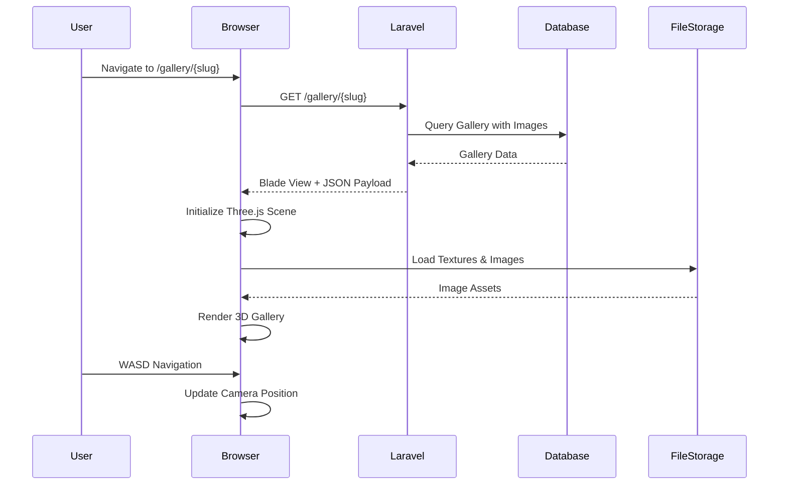
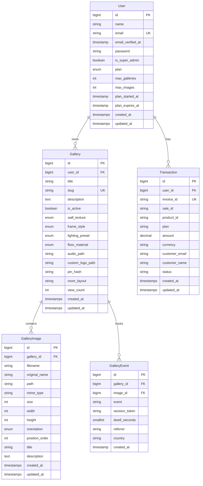
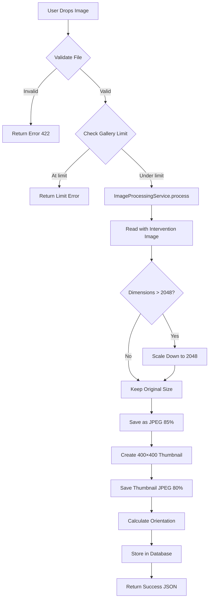

# Exospace 3D Gallery — Technical Documentation

> **Version:** 2.0.0
> **Last Updated:** April 22, 2026
> **Document Type:** Comprehensive Technical Reference

---

## Table of Contents

1. [Project Overview](#project-overview)
2. [Architecture & System Design](#architecture--system-design)
3. [Technology Stack](#technology-stack)
4. [Core Features](#core-features)
5. [Data Model & Database Schema](#data-model--database-schema)
6. [Backend Architecture](#backend-architecture)
7. [3D Rendering Engine](#3d-rendering-engine)
8. [Image Processing Pipeline](#image-processing-pipeline)
9. [User Interface Components](#user-interface-components)
10. [Security Considerations](#security-considerations)
11. [Design Decisions & Rationale](#design-decisions--rationale)
12. [Use Cases](#use-cases)
13. [File Structure Reference](#file-structure-reference)
14. [Deployment & Cloud Hosting](#deployment--cloud-hosting)
15. [API Reference](#api-reference)

---

## Project Overview

### What is Exospace?

**Exospace** is a SaaS web platform that enables users to create immersive, first-person walkable 3D virtual galleries. Users upload their artwork images through an admin panel, and the system automatically generates a fully navigable 3D gallery room rendered in real-time using WebGL. The platform operates on a freemium model with one-time lifetime plan upgrades processed via 2Checkout.

### Purpose & Vision

The platform solves the problem of digital art presentation by transforming static image collections into interactive, museum-like experiences. Key goals include:

- **Accessibility**: No 3D modeling or coding knowledge required
- **Immersion**: First-person navigation with WASD controls mimics real gallery visits
- **Customization**: Configurable wall textures, floor materials, lighting presets, and frame styles
- **Performance**: Optimized for modern browsers without plugins
- **Commerce**: Automated plan management via payment webhooks

### Target Users

| User Type | Use Case |
|-----------|----------|
| **Artists** | Showcase portfolios in immersive environments |
| **Galleries** | Create virtual exhibitions for remote viewing |
| **Museums** | Digital extensions of physical collections |
| **Educators** | Interactive art history presentations |
| **Photographers** | Premium presentation of photography work |

---

## Architecture & System Design

### High-Level Architecture

```
┌─────────────────────────────────────────────────────────────────────┐
│                         CLIENT (Browser)                             │
├─────────────────────────────────────────────────────────────────────┤
│  ┌─────────────────┐  ┌─────────────────┐  ┌─────────────────────┐  │
│  │   Admin Panel   │  │  Gallery Viewer │  │   Authentication    │  │
│  │   (Livewire)    │  │   (Three.js)    │  │   (Laravel Breeze)  │  │
│  └────────┬────────┘  └────────┬────────┘  └──────────┬──────────┘  │
└───────────┼────────────────────┼─────────────────────┼──────────────┘
            │                    │                     │
            ▼                    ▼                     ▼
┌─────────────────────────────────────────────────────────────────────┐
│                         SERVER (Laravel 12)                          │
├─────────────────────────────────────────────────────────────────────┤
│  ┌─────────────────┐  ┌─────────────────┐  ┌─────────────────────┐  │
│  │   Controllers   │  │    Services     │  │      Models         │  │
│  │  (Admin CRUD)   │  │ (ImageProcess)  │  │ (Gallery, User...)  │  │
│  └────────┬────────┘  └────────┬────────┘  └──────────┬──────────┘  │
└───────────┼────────────────────┼─────────────────────┼──────────────┘
            │                    │                     │
            ▼                    ▼                     ▼
┌─────────────────────────────────────────────────────────────────────┐
│                      DATA & STORAGE LAYER                            │
├─────────────────────────────────────────────────────────────────────┤
│  ┌─────────────────┐  ┌─────────────────┐  ┌─────────────────────┐  │
│  │   MySQL 8 DB    │  │  File Storage   │  │   Static Assets     │  │
│  │  (Eloquent ORM) │  │  (public/disk)  │  │   (Textures, JS)    │  │
│  └─────────────────┘  └─────────────────┘  └─────────────────────┘  │
└─────────────────────────────────────────────────────────────────────┘
```

### Request Flow


```mermaid
sequenceDiagram
    participant User
    participant Browser
    participant Laravel
    participant Database
    participant FileStorage

    User->>Browser: Navigate to /gallery/{slug}
    Browser->>Laravel: GET /gallery/{slug}
    Laravel->>Database: Query Gallery with Images
    Database-->>Laravel: Gallery Data
    Laravel-->>Browser: Blade View + JSON Payload
    Browser->>Browser: Initialize Three.js Scene
    Browser->>FileStorage: Load Textures & Images
    FileStorage-->>Browser: Image Assets
    Browser->>Browser: Render 3D Gallery
    User->>Browser: WASD Navigation
    Browser->>Browser: Update Camera Position
```

---

## Technology Stack

### Backend Technologies

| Technology | Version | Purpose |
|------------|---------|---------|
| **PHP** | 8.2+ | Server-side language |
| **Laravel** | 12.x | MVC framework |
| **Livewire** | 4.x | Reactive UI components |
| **Laravel Sanctum** | 4.2 | API authentication |
| **Laravel Breeze** | 2.3 | Authentication scaffolding |
| **Intervention Image** | 3.11 | Image processing & manipulation |
| **Spatie Media Library** | 11.17 | Media file management |
| **Resend Laravel** | 1.1 | Transactional email API |

### Frontend Technologies

| Technology | Version | Purpose |
|------------|---------|---------|
| **Three.js** | 0.160.0 | WebGL 3D rendering engine |
| **GSAP** | 3.14.2 | Animation library |
| **Alpine.js** | 3.4.2 | Lightweight reactivity |
| **Tailwind CSS** | 4.x | Utility-first CSS framework |
| **Vite** | 7.x | Asset bundling |
| **Axios** | 1.11 | HTTP client |

### Database & Storage

| Component | Technology | Notes |
|-----------|------------|-------|
| **Primary Database** | MySQL 8 (production) | Coolify-managed on DigitalOcean |
| **File Storage** | Laravel Filesystem | `public` disk |
| **Queue Backend** | Database queue | Laravel Queue with `jobs` table |
| **Caching** | File-based | Laravel Cache |
| **Email** | Resend API | Via `resend/resend-laravel` |

### Infrastructure

| Component | Technology | Notes |
|-----------|------------|-------|
| **Hosting** | DigitalOcean | VPS via Coolify |
| **Platform** | Coolify | Self-hosted PaaS |
| **Build System** | Nixpacks | `nixpacks.toml` |
| **Web Server** | Nginx + PHP-FPM | Configured in `docker-start.sh` |
| **Payment Processor** | 2Checkout (Verifone) | One-time purchases |

---

## Core Features

### 1. Gallery Management

**Capability**: Full CRUD operations for virtual galleries with customization options.

| Feature | Description |
|---------|-------------|
| Create Gallery | Title, description, and style configuration |
| Edit Gallery | Update settings and manage images |
| Delete Gallery | Cascade deletion of images |
| Toggle Active | Enable/disable public visibility |
| Analytics | Per-gallery visitor tracking |
| PIN Protection | Optional PIN gate for private galleries |

**Customization Options**:

```php
'wall_texture'    => ['white', 'concrete', 'brick', 'wood']
'frame_style'     => ['modern', 'classic', 'minimal']
'lighting_preset' => ['bright', 'moody', 'dramatic']
'floor_material'  => ['wood', 'marble', 'concrete']
'room_layout'     => configurable
```

### 2. User Subscription System

**Capability**: Tiered access control with automated plan management via 2Checkout.

| Feature | Free | Pro | Studio |
|---------|------|-----|--------|
| Max Galleries | 1 | 5 | Unlimited |
| Max Images/Gallery | 10 | 50 | Unlimited |
| Analytics | ❌ | ✅ | ✅ Advanced |
| Ambient Audio | ❌ | ❌ | ✅ |
| Custom Logo | ❌ | ❌ | ✅ |
| Support | Community | Email | Priority |
| Price | Free | $29 one-time | $99 one-time |

**Plan helpers on `User` model**:

```php
$user->isPro();           // true for pro and studio
$user->canCreateGallery(); // checks against max_galleries
$user->isSuperAdmin();    // checks is_super_admin flag
```

### 3. 2Checkout Payment Integration

**Capability**: Fully automated purchase-to-plan-upgrade pipeline with transaction history.

**Webhook Endpoints**:

| Endpoint | Handler | Events Handled |
|----------|---------|----------------|
| `POST /webhooks/2checkout` | `WebhookController@handle2Checkout` | `ORDER_CREATED` |
| `POST /webhooks/2checkout/refund` | `WebhookController@handleRefund` | Refunds & cancellations |

**Product ID Map** (configured via environment variables):

```php
$productMap = [
    config('services.2checkout.product_id_pro')    => [
        'plan'          => 'pro',
        'max_galleries' => 5,
        'max_images'    => 50,
    ],
    config('services.2checkout.product_id_studio') => [
        'plan'          => 'studio',
        'max_galleries' => 999,
        'max_images'    => 999,
    ],
];
```

**Security**: Every IPN verified via MD5 hash using `TWOCHECKOUT_SECRET_WORD` before any processing occurs.

**Transaction Storage**: All purchases and refunds written to `transactions` table with full audit trail.

**Required `.env` variables**:

```env
TWOCHECKOUT_ACCOUNT_NUMBER=
TWOCHECKOUT_SECRET_WORD=
TWOCHECKOUT_PRODUCT_ID_PRO=
TWOCHECKOUT_PRODUCT_ID_STUDIO=
```

### 4. Transaction History

**Capability**: Permanent record of all purchases and refunds for accounting and dispute resolution.

| Column | Description |
|--------|-------------|
| `invoice_id` | Unique 2Checkout invoice ID |
| `sale_id` | 2Checkout sale reference |
| `product_id` | 2Checkout product ID purchased |
| `plan` | Plan activated (pro / studio) |
| `amount` | Payment amount |
| `currency` | Payment currency (default USD) |
| `customer_email` | Purchaser email |
| `status` | `completed` or `refunded` |

### 5. Email Verification

**Capability**: Mandatory email verification before dashboard access, with queued delivery via Resend.

**Flow**:
1. User registers → `Registered` event fires → verification email queued
2. Welcome email sent separately via `User::booted()` hook
3. User redirected to `/email/verify` notice page
4. User clicks verification link in email → lands on dashboard
5. All admin routes protected by `verified` middleware

**Components**:

| Component | Location |
|-----------|----------|
| `MustVerifyEmail` | `app/Models/User.php` |
| Verification view | `resources/views/auth/verify-email.blade.php` |
| Welcome email | `app/Mail/WelcomeEmail.php` (implements `ShouldQueue`) |
| Email template | `resources/views/emails/welcome.blade.php` |

### 6. Analytics Tracking

**Capability**: Real-time visitor analytics per gallery with event-level granularity.

| Event Type | Description |
|------------|-------------|
| `view` | Gallery opened by a visitor |
| `focus` | Visitor inspected a specific artwork (pressed E) |
| `tour_start` | Guided tour initiated |
| `tour_complete` | Guided tour completed |

**Data Captured per Event**:
- `session_token` — Random UUID per visitor session (no auth required)
- `dwell_seconds` — Time spent (view events)
- `referrer` — Traffic source domain
- `country` — Two-letter country code (via GeoIP, optional)
- `image_id` — For focus events, which artwork was inspected

**Analytics Dashboard** (`/admin/galleries/{gallery}/analytics`):
- Total views and unique visitors (30-day chart)
- Average dwell time
- Top artworks by focus count
- Referrer breakdown

**Rate Limiting**: Analytics tracking endpoint throttled at 120 events per minute per IP.

### 7. PIN-Protected Galleries

**Capability**: Optional PIN gate for private or client-preview galleries.

| Feature | Implementation |
|---------|----------------|
| PIN Setting | Hashed via `Hash::make()` on save |
| PIN Verification | `Gallery::verifyPin()` using `Hash::check()` |
| Session Gate | PIN verified once per session |
| Public URL | Unaffected — PIN only gates entry |

**Database Column**: `galleries.pin_hash` (nullable string)

### 8. 3D Gallery Viewer

**Capability**: Real-time WebGL-rendered virtual gallery with first-person navigation.

| Feature | Implementation |
|---------|----------------|
| First-Person Controls | PointerLockControls (Three.js) |
| Movement | WASD keys with variable speed (1×/2×/4×/8×) |
| Sprint | Left Shift key |
| Look Around | Mouse movement |
| Artwork Info | Press E to inspect / zoom |
| Collision Detection | Room boundary constraints |
| Mobile | Virtual joystick + look pad |

### 9. Dynamic Lighting System

**Capability**: Proximity-based artwork illumination with cinematic tone mapping.

| Preset | Ambient | Spotlight | Fill Light |
|--------|---------|-----------|------------|
| **Bright** | 0.7 | 1.2 | 0.5 |
| **Moody** | 0.4 | 0.8 | 0.3 |
| **Dramatic** | 0.25 | 1.5 | 0.15 |

Proximity lights activate for artworks within 5 meters. Tone mapping: `ACESFilmicToneMapping` at exposure 0.8.

### 10. Momentum Camera System

**Capability**: Physics-based camera movement with weight, friction, and cinematic banking.

| Parameter | Value | Effect |
|-----------|-------|--------|
| `damping` | 10.0 | Friction / weighted stop |
| `acceleration` | 40.0 m/s² | Smooth ramp-up |
| `maxSpeed` | 3.0 m/s | Top velocity |
| `maxLean` | 0.02 rad | Cinematic tilt into turns |

### 11. Tactile Art System

**Capability**: Realistic canvas texture simulation using normal mapping on all artwork surfaces.

- Normal map applied to `MeshStandardMaterial` (roughness 0.75)
- Smart grain scaling based on artwork dimensions
- Asset: `/assets/textures/shared/canvas_normal.jpg`

### 12. Mobile & Touch Input System

**Capability**: Full mobile compatibility with touch-optimized controls.

| Component | Implementation |
|-----------|----------------|
| Virtual Joystick | On-screen joystick for movement (left thumb) |
| Look Pad | Dedicated area for camera rotation (right thumb) |
| Adaptive UI | Auto-detection disables keyboard hints, shows touch overlays |
| Detection | `navigator.maxTouchPoints` + User-Agent |

### 13. Interactive SFX Engine

**Capability**: Dynamic sound effects for immersion and interaction feedback.

| Feature | Details |
|---------|---------|
| Footsteps | Velocity-based trigger with walk/sprint cadence |
| Pitch Variance | 0.95×–1.05× randomization prevents fatigue |
| UI Acoustics | Focus mode, click feedback |
| Architecture | Audio Listener attached to camera for spatial positioning |

### 14. Ambient Audio System

**Capability**: Optional background music per gallery (Studio plan feature).

| Feature | Implementation |
|---------|----------------|
| Upload | MP3/WAV via gallery edit form |
| Storage | `storage/galleries/{id}/audio/` |
| Playback | HTML5 Audio API, looped |
| Control | Mute/unmute button in viewer UI |

### 15. Studio Branding (Custom Logo)

**Capability**: White-label branding for Studio plan users.

| Feature | Implementation |
|---------|----------------|
| Upload | PNG/JPG/SVG via gallery edit form |
| Storage | `storage/galleries/{id}/logo/` |
| Display | Replaces Exospace logo in gallery viewer header |

### 16. Super Admin Panel

**Capability**: Platform-wide administration accessible at `/master-control`.

| Feature | Description |
|---------|-------------|
| User List | All users with gallery counts and plan info |
| Plan Management | Upgrade/downgrade any user's plan |
| User Deletion | Cascade delete with full file cleanup |
| Gallery Oversight | View and toggle any gallery's active status |
| Platform Stats | Users by plan, total galleries, images, views |

**Access Control**: `is_super_admin` boolean on `users` table, protected by `EnsureUserIsSuperAdmin` middleware.

### 17. Security Headers

**Capability**: Global middleware enforcing security best practices on all HTTP responses.

| Header | Value | Purpose |
|--------|-------|---------|
| `X-Frame-Options` | `DENY` | Prevents clickjacking |
| `Strict-Transport-Security` | `max-age=31536000; includeSubDomains` | Forces HTTPS for 1 year |
| `X-Content-Type-Options` | `nosniff` | Blocks MIME sniffing |
| `X-Permitted-Cross-Domain-Policies` | `none` | Restricts cross-domain access |
| `Referrer-Policy` | `strict-origin-when-cross-origin` | Controls referrer sharing |

**Implementation**: `app/Http/Middleware/SecurityHeaders.php` registered globally in `bootstrap/app.php`.

### 18. Cookie Consent Banner

**Capability**: GDPR-compliant cookie consent with user preference persistence.

| Feature | Implementation |
|---------|----------------|
| UI | Fixed bottom banner with Accept/Decline |
| Storage | Browser cookie `exospace_cookie_consent` (365-day expiry) |
| Reactivity | Alpine.js with fade-in animation |
| Location | `resources/views/layouts/partials/cookie-banner.blade.php` |

### 19. Legal & Compliance Pages

**Capability**: Full legal page suite required for 2Checkout merchant approval and regulatory compliance.

| Page | Route | Description |
|------|-------|-------------|
| Privacy Policy | `/privacy` | Data collection, usage, and protection |
| Terms of Service | `/terms` | User agreement, one-time purchase terms |
| Refund Policy | `/refund-policy` | 14-day money-back guarantee |
| Payment Security | `/payment-security` | PCI DSS, SSL, 2Checkout data handling |
| About Us | `/about` | Company story, mission, registered address |
| Contact Us | `/contact` | Support and sales inquiry form |
| Pricing | `/pricing` | Plan comparison with live checkout modals |

All pages reflect the one-time lifetime purchase model — no subscription or auto-renewal language.

### 20. Email Queue System

**Capability**: Asynchronous email delivery via Resend API.

| Component | Implementation |
|-----------|----------------|
| Provider | Resend API (`resend/resend-laravel`) |
| Queue Backend | `database` driver |
| Welcome Email | `App\Mail\WelcomeEmail` (implements `ShouldQueue`) |
| Template | `resources/views/emails/welcome.blade.php` |

**Queue Worker** (runs on startup via `docker-start.sh`):
```bash
php artisan queue:work --tries=3 --timeout=90 --sleep=3 &
```

### 21. Gallery Sharing & Demo

| Feature | Implementation |
|---------|----------------|
| Share Modal | Copy-to-clipboard URL in admin gallery list |
| Demo URL | `/gallery/demo` redirects to first active gallery |
| Fallback | Homepage with error if no galleries exist |

### 22. Artwork Focus Mode

**Capability**: Cinematic zoom-in for detailed artwork viewing.

| Feature | Implementation |
|---------|----------------|
| Activation | Press E while looking at artwork |
| Animation | GSAP smooth camera transition (1.5s in, 1.2s out) |
| Movement Lock | Player movement disabled during focus |
| Exit | Press E again or ESC |

---

## Data Model & Database Schema

### Entity Relationship Diagram


```mermaid
erDiagram
    User ||--o{ Gallery : owns
    User ||--o{ Transaction : has
    Gallery ||--o{ GalleryImage : contains
    Gallery ||--o{ GalleryEvent : tracks

    User {
        bigint id PK
        string name
        string email UK
        timestamp email_verified_at
        string password
        boolean is_super_admin
        enum plan
        int max_galleries
        int max_images
        timestamp plan_started_at
        timestamp plan_expires_at
        timestamps created_at
        timestamps updated_at
    }

    Gallery {
        bigint id PK
        bigint user_id FK
        string title
        string slug UK
        text description
        boolean is_active
        enum wall_texture
        enum frame_style
        enum lighting_preset
        enum floor_material
        string audio_path
        string custom_logo_path
        string pin_hash
        string room_layout
        int view_count
        timestamps created_at
        timestamps updated_at
    }

    GalleryImage {
        bigint id PK
        bigint gallery_id FK
        string filename
        string original_name
        string path
        string mime_type
        int size
        int width
        int height
        enum orientation
        int position_order
        string title
        text description
        timestamps created_at
        timestamps updated_at
    }

    GalleryEvent {
        bigint id PK
        bigint gallery_id FK
        bigint image_id FK
        string event
        string session_token
        smallint dwell_seconds
        string referrer
        string country
        timestamp created_at
    }

    Transaction {
        bigint id PK
        bigint user_id FK
        string invoice_id UK
        string sale_id
        string product_id
        string plan
        decimal amount
        string currency
        string customer_email
        string customer_name
        string status
        timestamps created_at
        timestamps updated_at
    }
```

### Table: `users`

| Column | Type | Default | Description |
|--------|------|---------|-------------|
| `id` | BIGINT PK | auto | Primary key |
| `name` | VARCHAR(255) | — | User's full name |
| `email` | VARCHAR(255) UNIQUE | — | Login email |
| `email_verified_at` | TIMESTAMP | NULL | Verification timestamp |
| `is_super_admin` | BOOLEAN INDEXED | false | Platform admin flag |
| `password` | VARCHAR(255) | — | Bcrypt hash |
| `plan` | ENUM | `free` | free / pro / studio |
| `max_galleries` | INT UNSIGNED | 1 | Gallery creation limit |
| `max_images` | INT UNSIGNED | 10 | Images per gallery limit |
| `plan_started_at` | TIMESTAMP | NULL | Plan activation date |
| `plan_expires_at` | TIMESTAMP | NULL | NULL = lifetime |
| `created_at` / `updated_at` | TIMESTAMP | — | Eloquent timestamps |

### Table: `galleries`

| Column | Type | Default | Description |
|--------|------|---------|-------------|
| `id` | BIGINT PK | auto | Primary key |
| `user_id` | BIGINT FK | — | Owner reference |
| `title` | VARCHAR(255) | — | Gallery name |
| `slug` | VARCHAR(255) UNIQUE | — | URL-safe identifier (auto-generated) |
| `description` | TEXT | NULL | Gallery description |
| `is_active` | BOOLEAN | true | Public visibility toggle |
| `wall_texture` | ENUM | `white` | Wall material |
| `frame_style` | ENUM | `modern` | Frame appearance |
| `lighting_preset` | ENUM | `bright` | Light configuration |
| `floor_material` | ENUM | `wood` | Floor texture |
| `audio_path` | VARCHAR(500) | NULL | Ambient audio file path |
| `custom_logo_path` | VARCHAR(500) | NULL | Branding logo path |
| `pin_hash` | VARCHAR(255) | NULL | Hashed PIN (nullable = open) |
| `room_layout` | STRING | NULL | Room configuration |
| `view_count` | INT UNSIGNED | 0 | Total view counter |

### Table: `gallery_images`

| Column | Type | Default | Description |
|--------|------|---------|-------------|
| `id` | BIGINT PK | auto | Primary key |
| `gallery_id` | BIGINT FK | — | Parent gallery |
| `filename` | VARCHAR(255) | — | Processed filename |
| `original_name` | VARCHAR(255) | — | Original upload name |
| `path` | VARCHAR(500) | — | Storage path |
| `mime_type` | VARCHAR(100) | — | File MIME type |
| `size` | INT UNSIGNED | — | File size in bytes |
| `width` / `height` | INT UNSIGNED | — | Image dimensions (px) |
| `orientation` | ENUM | — | portrait / landscape / square |
| `position_order` | INT UNSIGNED | 0 | Display order |
| `title` | VARCHAR(255) | NULL | Artwork title |
| `description` | TEXT | NULL | Artwork description |

### Table: `gallery_events`

| Column | Type | Description |
|--------|------|-------------|
| `id` | BIGINT PK | Primary key |
| `gallery_id` | BIGINT FK | Parent gallery |
| `image_id` | BIGINT FK NULL | Artwork (for focus events) |
| `event` | VARCHAR(32) INDEXED | view / focus / tour_start / tour_complete |
| `session_token` | VARCHAR(64) INDEXED | Anonymous visitor session UUID |
| `dwell_seconds` | SMALLINT UNSIGNED NULL | Time on page |
| `referrer` | VARCHAR(255) NULL | Traffic source domain |
| `country` | VARCHAR(2) NULL | ISO country code |
| `created_at` | TIMESTAMP INDEXED | Event time |

### Table: `transactions`

| Column | Type | Description |
|--------|------|-------------|
| `id` | BIGINT PK | Primary key |
| `user_id` | BIGINT FK INDEXED | Purchasing user |
| `invoice_id` | VARCHAR UNIQUE | 2Checkout invoice ID |
| `sale_id` | VARCHAR NULL | 2Checkout sale reference |
| `product_id` | VARCHAR NULL | 2Checkout product ID |
| `plan` | VARCHAR | Plan purchased (pro / studio) |
| `amount` | DECIMAL(10,2) | Payment amount |
| `currency` | VARCHAR(10) | Payment currency |
| `customer_email` | VARCHAR INDEXED | Purchaser email |
| `customer_name` | VARCHAR NULL | Purchaser name |
| `status` | VARCHAR INDEXED | completed / refunded |
| `created_at` / `updated_at` | TIMESTAMP | Eloquent timestamps |

---

## Backend Architecture

### Controller Structure

```
app/Http/Controllers/
├── Admin/
│   ├── AnalyticsController.php    # Gallery analytics dashboard
│   ├── DashboardController.php    # Admin home
│   ├── GalleryController.php      # Gallery CRUD + audio/logo upload
│   └── ImageController.php        # Image upload/delete/reorder
├── Auth/                          # Laravel Breeze controllers
├── SuperAdmin/
│   └── SystemController.php       # Platform-wide administration
├── GalleryPinController.php       # PIN gate show + verify
├── GalleryViewController.php      # Public gallery display
├── InstallerController.php        # First-run setup
├── ProfileController.php          # User profile management
└── WebhookController.php          # 2Checkout IPN + refund handler
```

### Route Definitions

```php
// Public Routes
Route::get('/gallery/{slug}', [GalleryViewController::class, 'show']);
Route::get('/gallery/{slug}/pin', [GalleryPinController::class, 'show']);
Route::post('/gallery/{slug}/pin', [GalleryPinController::class, 'verify']);
Route::post('/gallery/{gallery}/track', [AnalyticsController::class, 'track'])
    ->middleware('throttle:120,1');

// Webhook Routes (no auth)
Route::post('/webhooks/2checkout', [WebhookController::class, 'handle2Checkout']);
Route::post('/webhooks/2checkout/refund', [WebhookController::class, 'handleRefund']);

// Admin Routes (auth + verified required)
Route::middleware(['auth', 'verified'])->prefix('admin')->group(function () {
    Route::resource('galleries', GalleryController::class);
    Route::post('galleries/{gallery}/upload-audio', ...);
    Route::post('galleries/{gallery}/upload-logo', ...);
    Route::post('galleries/{gallery}/reorder-images', ...);
    Route::get('galleries/{gallery}/analytics', [AnalyticsController::class, 'show']);
    Route::post('galleries/{gallery}/images', [ImageController::class, 'store']);
    Route::delete('images/{image}', [ImageController::class, 'destroy']);
    Route::post('images/bulk-delete', [ImageController::class, 'bulkDestroy']);
});

// Super Admin Routes
Route::middleware(['auth', 'verified', 'super_admin'])->prefix('master-control')->group(function () {
    Route::get('/', [SystemController::class, 'index']);
    Route::post('/users/{user}/plan', [SystemController::class, 'updatePlan']);
    Route::delete('/users/{user}', [SystemController::class, 'deleteUser']);
    Route::get('/users/{user}/galleries', [SystemController::class, 'userGalleries']);
    Route::post('/galleries/{gallery}/toggle', [SystemController::class, 'toggleGallery']);
});
```

### Service Layer

**`ImageProcessingService`** handles all image manipulation:

```php
class ImageProcessingService
{
    public function process(UploadedFile $file, int $galleryId): array
    {
        // 1. Generate unique filename
        // 2. Create storage directories
        // 3. Resize to max 2048×2048 (WebGL texture limit)
        // 4. Generate 400×400 thumbnail
        // 5. Save as JPEG (85% quality main, 80% thumbnail)
        // 6. Return metadata array
    }

    public function delete(string $path): void
    {
        // Delete main image and associated thumbnail
    }
}
```

---

## 3D Rendering Engine

### GalleryScene Class

The core 3D engine (`view.blade.php`) implements a complete WebGL gallery system:

```javascript
class GalleryScene {
    constructor() {
        this.scene    = new THREE.Scene();
        this.camera   = new THREE.PerspectiveCamera(75, aspect, 0.1, 100);
        this.renderer = new THREE.WebGLRenderer({ antialias: true });
        this.controls = new PointerLockControls(this.camera, document.body);
    }
}
```

### Configuration Constants

```javascript
const CONFIG = {
    camera: {
        fov: 75, near: 0.1, far: 100, height: 1.6,
        damping: 10.0, acceleration: 40.0, maxSpeed: 3.0, maxLean: 0.02
    },
    movement: {
        baseSpeed: 0.1,
        speedMultipliers: [1, 2, 4, 8],
        sprintMultiplier: 1.5
    },
    room: {
        wallHeight: 4, artworkSpacing: 3.5,
        minWallLength: 8, wallDepth: 0.3
    },
    lighting: { proximityDistance: 5 }
};
```

### Rendering Pipeline

```
1. Asset Loading
   ├── Wall Texture (configured type)
   ├── Floor Texture (configured type)
   └── Artwork Images (async parallel)

2. Scene Construction
   ├── Room Geometry (floor, 4 walls, ceiling)
   ├── Artwork Placement (calculated per wall)
   └── Lighting Setup (ambient, hemisphere, directional, proximity points)

3. Animation Loop (60 FPS target)
   ├── updateMovement()           # WASD + collision + physics
   ├── updateProximityLighting()  # Dynamic spotlight activation
   ├── checkArtworkFocus()        # Raycasting for E key
   ├── updateAudio()              # Footstep + SFX logic
   └── renderer.render()          # Draw frame
```

### Visual Atmosphere

```javascript
// Depth fog
this.scene.fog = new THREE.Fog(0x0a0a0a, 10, 30);

// Cinematic tone mapping
this.renderer.toneMapping = THREE.ACESFilmicToneMapping;
this.renderer.toneMappingExposure = 0.8;
this.renderer.outputColorSpace = THREE.SRGBColorSpace;
```

---

## Image Processing Pipeline

### Upload Flow


```mermaid
flowchart TD
    A[User Drops Image] --> B{Validate File}
    B -->|Invalid| C[Return Error 422]
    B -->|Valid| D{Check Gallery Limit}
    D -->|At limit| E[Return Limit Error]
    D -->|Under limit| F[ImageProcessingService.process]
    F --> G[Read with Intervention Image]
    G --> H{Dimensions > 2048?}
    H -->|Yes| I[Scale Down to 2048]
    H -->|No| J[Keep Original Size]
    I --> J
    J --> K[Save as JPEG 85%]
    K --> L[Create 400×400 Thumbnail]
    L --> M[Save Thumbnail JPEG 80%]
    M --> N[Calculate Orientation]
    N --> O[Store in Database]
    O --> P[Return Success JSON]
```

### Validation Rules

```php
$validator = Validator::make($request->all(), [
    'file' => 'required|file|image|mimes:jpeg,png,jpg,webp|max:10240'
]);
```

### Storage Structure

```
storage/app/public/
└── galleries/
    └── {gallery_id}/
        ├── abc123.jpg           # Main image (max 2048×2048, JPEG 85%)
        └── thumbnails/
            └── abc123.jpg       # Thumbnail (400×400, JPEG 80%)
```

---

## Security Considerations

### Authentication & Authorization

| Layer | Implementation |
|-------|----------------|
| Authentication | Laravel Breeze (session-based) |
| Email Verification | `MustVerifyEmail` on `User` model |
| Password Hashing | Bcrypt (12 rounds) |
| CSRF Protection | Automatic via `@csrf` directive |
| Route Protection | `auth` + `verified` middleware stack |

### Gallery Ownership Verification

Every admin action verifies the authenticated user owns the gallery:

```php
if ($gallery->user_id !== Auth::id()) {
    abort(403);
}
```

### Webhook Security

2Checkout IPN verified via MD5 hash before any user updates:

```php
$stringToHash = strlen($sale_id) . $sale_id .
                strlen($vendor_id) . $vendor_id .
                strlen($invoice_id) . $invoice_id .
                strlen($secretWord) . $secretWord;

$calculatedHash = strtoupper(md5($stringToHash));
// Must match $receivedHash or request rejected with 403
```

### File Upload Security

| Check | Implementation |
|-------|----------------|
| MIME Validation | `mimes:jpeg,png,jpg,webp` |
| Size Limit | `max:10240` (10MB) |
| Extension Whitelist | Explicit allowlist only |
| Storage | Outside web root via symbolic link |

---

## Design Decisions & Rationale

| Decision | Rationale |
|----------|-----------|
| **MySQL over SQLite** | SaaS requires concurrent writes, row locking, and managed backups — SQLite is single-writer only |
| **One-time pricing** | Reduces churn, simplifies webhook logic, no subscription management overhead |
| **2Checkout over Stripe** | Better global payment coverage, especially for markets without Stripe support |
| **Coolify on DigitalOcean** | Full server control with PaaS convenience, no vendor lock-in |
| **Database queue** | No Redis dependency required, simplifies infrastructure for current scale |
| **Three.js over Unity/Unreal** | Browser-native, no plugins, ~600KB vs multi-MB game engines, mobile WebGL support |
| **2048×2048 image limit** | WebGL texture limits on many devices; prevents browser crashes and speeds load |
| **Proximity lighting** | Only 1 active spotlight at a time for performance; mimics museum spotlights |
| **Resend over SMTP** | Superior deliverability, analytics, and developer experience over raw SMTP |

---

## Use Cases

### Use Case 1: Artist Portfolio

**Actor**: Independent Artist
**Goal**: Showcase artwork professionally online

1. Register account → verify email
2. Create gallery with "Moody" lighting preset
3. Upload 20 high-resolution artwork images
4. Share public URL on social media
5. Monitor analytics for engagement

### Use Case 2: Virtual Exhibition

**Actor**: Gallery Owner
**Goal**: Extend physical exhibition to remote viewers

1. Purchase Studio plan for branding
2. Upload custom logo for white-label experience
3. Create gallery matching physical space aesthetic
4. Set PIN for preview-only access before opening
5. Remove PIN on opening day, share URL publicly

### Use Case 3: Educational Presentation

**Actor**: Art History Teacher
**Goal**: Create interactive learning material

1. Create gallery titled "Renaissance Masters"
2. Upload artworks with detailed descriptions
3. Share URL with students
4. Students press E to inspect artwork details
5. Class discusses observations in real-time

### Use Case 4: Photography Showcase

**Actor**: Professional Photographer
**Goal**: Premium portfolio presentation for clients

1. Purchase Pro plan for up to 5 galleries
2. Create gallery per project with "Dramatic" lighting
3. Upload curated photo collection
4. Share private link with client via PIN protection
5. Remove PIN after client approval

---

## File Structure Reference

```
exospace/
├── app/
│   ├── Http/
│   │   ├── Controllers/
│   │   │   ├── Admin/
│   │   │   │   ├── AnalyticsController.php    # Analytics dashboard
│   │   │   │   ├── DashboardController.php    # Admin home
│   │   │   │   ├── GalleryController.php      # Gallery CRUD
│   │   │   │   └── ImageController.php        # Image management
│   │   │   ├── SuperAdmin/
│   │   │   │   └── SystemController.php       # Platform administration
│   │   │   ├── Auth/                          # Breeze auth controllers
│   │   │   ├── GalleryPinController.php       # PIN gate
│   │   │   ├── GalleryViewController.php      # Public gallery view
│   │   │   ├── InstallerController.php        # First-run setup
│   │   │   ├── ProfileController.php          # User profile
│   │   │   └── WebhookController.php          # 2Checkout IPN handler
│   │   ├── Middleware/
│   │   │   ├── EnsureUserIsSuperAdmin.php     # Super admin gate
│   │   │   └── SecurityHeaders.php            # HTTP security headers
│   │   └── Requests/
│   ├── Mail/
│   │   └── WelcomeEmail.php                   # Queued welcome email
│   ├── Models/
│   │   ├── Gallery.php
│   │   ├── GalleryEvent.php                   # Analytics events
│   │   ├── GalleryImage.php
│   │   ├── Setting.php
│   │   └── User.php                           # MustVerifyEmail, plan helpers
│   ├── Providers/
│   └── Services/
│       └── ImageProcessingService.php
├── config/
│   └── services.php                           # 2Checkout credentials config
├── database/
│   └── migrations/
│       ├── create_users_table.php
│       ├── create_galleries_table.php
│       ├── create_gallery_images_table.php
│       ├── create_settings_table.php
│       ├── add_plans_to_users_table.php
│       ├── add_audio_to_galleries_table.php
│       ├── add_custom_logo_to_galleries_table.php
│       ├── add_super_admin_flag_to_users_table.php
│       ├── add_room_layout_to_galleries_table.php
│       ├── create_gallery_analytics_table.php
│       ├── add_pin_to_galleries_table.php
│       └── create_transactions_table.php      # Purchase + refund history
├── resources/
│   └── views/
│       ├── admin/
│       │   ├── dashboard.blade.php
│       │   └── galleries/
│       ├── auth/
│       │   └── verify-email.blade.php         # Email verification notice
│       ├── emails/
│       │   └── welcome.blade.php
│       ├── gallery/
│       │   └── view.blade.php                 # Three.js 3D engine
│       ├── layouts/
│       │   └── partials/
│       │       ├── cookie-banner.blade.php
│       │       └── footer.blade.php
│       ├── pages/
│       │   ├── about.blade.php
│       │   ├── contact.blade.php              # Real address populated
│       │   ├── pricing.blade.php              # Live 2Checkout modals
│       │   ├── privacy.blade.php
│       │   ├── refund.blade.php               # One-time purchase language
│       │   ├── security.blade.php
│       │   └── terms.blade.php                # One-time purchase language
│       └── super-admin/
├── routes/
│   ├── web.php
│   └── auth.php
├── .env.example
├── composer.json
├── docker-start.sh                            # Coolify startup script
├── nixpacks.toml                              # Build config (includes migrate)
├── tailwind.config.js
└── vite.config.js
```

---

## Deployment & Cloud Hosting

### Infrastructure Stack

| Layer | Service |
|-------|---------|
| VPS | DigitalOcean Droplet |
| PaaS | Coolify (self-hosted) |
| Database | MySQL 8 (Coolify-managed) |
| Build | Nixpacks |
| Web Server | Nginx + PHP-FPM |
| Email | Resend API |
| Payments | 2Checkout |
| Domain | exospace.gallery (HTTPS) |

### Nixpacks Configuration

**File:** `nixpacks.toml`

```toml
[phases.setup]
nixPkgs = ["php", "nginx", "nodejs", "phpPackages.composer"]

[phases.build]
cmds = [
    "npm install",
    "npm run build",
    "composer install --no-dev --optimize-autoloader",
    "php artisan migrate --force",
    "php artisan config:cache",
    "php artisan route:cache",
    "php artisan view:cache"
]

[start]
cmd = "bash docker-start.sh"
```

### Build Phases

| Phase | Actions |
|-------|---------|
| **Setup** | Installs PHP, Nginx, Node.js, Composer via Nix |
| **Build** | Compiles assets, installs PHP deps, runs migrations, caches Laravel config |
| **Start** | Executes container startup script |

### Container Startup Script

**File:** `docker-start.sh`

Configures PHP upload limits, patches Nginx for 50MB uploads, starts queue worker in background, then starts PHP-FPM and Nginx.

| Setting | Value | Purpose |
|---------|-------|---------|
| `upload_max_filesize` | 50MB | Large artwork uploads |
| `post_max_size` | 50MB | Match upload limit |
| `memory_limit` | 512MB | Image processing headroom |
| `max_execution_time` | 300s | Batch upload operations |
| `client_max_body_size` | 50MB | Nginx request body |

### Environment Variables Reference

| Variable | Required | Description |
|----------|----------|-------------|
| `APP_KEY` | ✅ | Laravel encryption key |
| `APP_ENV` | ✅ | `production` |
| `APP_URL` | ✅ | `https://exospace.gallery` |
| `DB_CONNECTION` | ✅ | `mysql` |
| `DB_HOST` | ✅ | Coolify internal MySQL host |
| `DB_DATABASE` | ✅ | `exospace` |
| `DB_USERNAME` | ✅ | MySQL user |
| `DB_PASSWORD` | ✅ | MySQL password |
| `FILESYSTEM_DISK` | ✅ | `public` |
| `QUEUE_CONNECTION` | ✅ | `database` |
| `RESEND_API_KEY` | ✅ | Resend email API key |
| `MAIL_MAILER` | ✅ | `resend` |
| `MAIL_FROM_ADDRESS` | ✅ | `noreply@exospace.gallery` |
| `TWOCHECKOUT_ACCOUNT_NUMBER` | ✅ | 2Checkout vendor account |
| `TWOCHECKOUT_SECRET_WORD` | ✅ | IPN hash verification secret |
| `TWOCHECKOUT_PRODUCT_ID_PRO` | ✅ | 2Checkout product ID for Pro plan |
| `TWOCHECKOUT_PRODUCT_ID_STUDIO` | ✅ | 2Checkout product ID for Studio plan |
| `SESSION_SECURE_COOKIE` | ✅ | `true` |
| `SESSION_DOMAIN` | ✅ | `exospace.gallery` |
| `TRUSTED_PROXIES` | ✅ | `*` (Coolify reverse proxy) |

---

## API Reference

### Admin Gallery Endpoints

| Method | Endpoint | Description |
|--------|----------|-------------|
| GET | `/admin/galleries` | List user's galleries |
| GET | `/admin/galleries/create` | Create form |
| POST | `/admin/galleries` | Store new gallery |
| GET | `/admin/galleries/{id}/edit` | Edit form |
| PUT | `/admin/galleries/{id}` | Update gallery |
| DELETE | `/admin/galleries/{id}` | Delete gallery |
| POST | `/admin/galleries/{id}/upload-audio` | Upload ambient audio |
| POST | `/admin/galleries/{id}/upload-logo` | Upload custom logo |
| POST | `/admin/galleries/{id}/reorder-images` | Reorder image positions |
| GET | `/admin/galleries/{id}/analytics` | Analytics dashboard |

### Admin Image Endpoints

| Method | Endpoint | Description |
|--------|----------|-------------|
| POST | `/admin/galleries/{id}/images` | Upload image |
| DELETE | `/admin/images/{id}` | Delete single image |
| POST | `/admin/images/bulk-delete` | Bulk delete |

### Public Endpoints

| Method | Endpoint | Description |
|--------|----------|-------------|
| GET | `/` | Landing page |
| GET | `/gallery/{slug}` | 3D gallery viewer |
| GET | `/gallery/{slug}/pin` | PIN entry screen |
| POST | `/gallery/{slug}/pin` | PIN verification |
| POST | `/gallery/{gallery}/track` | Analytics event tracking |
| GET | `/gallery/demo` | Redirect to first active gallery |
| GET | `/pricing` | Plan comparison + checkout |
| GET | `/privacy` | Privacy Policy |
| GET | `/terms` | Terms of Service |
| GET | `/refund-policy` | Refund Policy |
| GET | `/payment-security` | Payment Security |
| GET | `/about` | About Us |
| GET | `/contact` | Contact |

### Webhook Endpoints

| Method | Endpoint | Description |
|--------|----------|-------------|
| POST | `/webhooks/2checkout` | 2Checkout IPN (ORDER_CREATED) |
| POST | `/webhooks/2checkout/refund` | 2Checkout refund handler |

### Super Admin Endpoints

| Method | Endpoint | Description |
|--------|----------|-------------|
| GET | `/master-control` | Super admin dashboard |
| POST | `/master-control/users/{id}/plan` | Update user's plan |
| DELETE | `/master-control/users/{id}` | Delete user and all data |
| GET | `/master-control/users/{id}/galleries` | View user's galleries |
| POST | `/master-control/galleries/{id}/toggle` | Toggle gallery active status |

---

*Exospace 3D Gallery — Technical Documentation v2.0.0*
*Last updated: April 22, 2026*