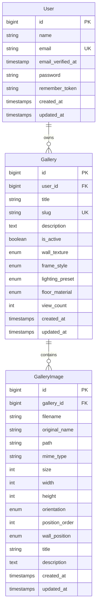

# Exospace 3D Gallery — Technical Documentation

> **Version:** 1.1.0  
> **Last Updated:** January 2026  
> **Document Type:** Comprehensive Technical Reference

---

## Table of Contents

1. [Project Overview](#project-overview)
2. [Architecture & System Design](#architecture--system-design)
3. [Technology Stack](#technology-stack)
4. [Core Features](#core-features)
5. [Data Model & Database Schema](#data-model--database-schema)
6. [Backend Architecture](#backend-architecture)
7. [3D Rendering Engine](#3d-rendering-engine)
8. [Image Processing Pipeline](#image-processing-pipeline)
9. [User Interface Components](#user-interface-components)
10. [Security Considerations](#security-considerations)
11. [Design Decisions & Rationale](#design-decisions--rationale)
12. [Use Cases](#use-cases)
13. [File Structure Reference](#file-structure-reference)

---

## Project Overview

### What is Exospace?

**Exospace** is a web-based 3D virtual gallery platform that enables users to create immersive, first-person walkable exhibitions. Users upload their artwork images through an admin panel, and the system automatically generates a fully navigable 3D gallery room rendered in real-time using WebGL.

### Purpose & Vision

The platform solves the problem of digital art presentation by transforming static image collections into interactive, museum-like experiences. Key goals include:

- **Accessibility**: No 3D modeling or coding knowledge required
- **Immersion**: First-person navigation with WASD controls mimics real gallery visits
- **Customization**: Configurable wall textures, floor materials, lighting presets, and frame styles
- **Performance**: Optimized for modern browsers without plugins

### Target Users

| User Type | Use Case |
|-----------|----------|
| **Artists** | Showcase portfolios in immersive environments |
| **Galleries** | Create virtual exhibitions for remote viewing |
| **Museums** | Digital extensions of physical collections |
| **Educators** | Interactive art history presentations |
| **Photographers** | Premium presentation of photography work |

---

## Architecture & System Design

### High-Level Architecture

```
┌─────────────────────────────────────────────────────────────────────┐
│                         CLIENT (Browser)                             │
├─────────────────────────────────────────────────────────────────────┤
│  ┌─────────────────┐  ┌─────────────────┐  ┌─────────────────────┐  │
│  │   Admin Panel   │  │  Gallery Viewer │  │   Authentication    │  │
│  │   (Livewire)    │  │   (Three.js)    │  │   (Laravel Breeze)  │  │
│  └────────┬────────┘  └────────┬────────┘  └──────────┬──────────┘  │
└───────────┼────────────────────┼─────────────────────┼──────────────┘
            │                    │                     │
            ▼                    ▼                     ▼
┌─────────────────────────────────────────────────────────────────────┐
│                         SERVER (Laravel 12)                          │
├─────────────────────────────────────────────────────────────────────┤
│  ┌─────────────────┐  ┌─────────────────┐  ┌─────────────────────┐  │
│  │   Controllers   │  │    Services     │  │      Models         │  │
│  │  (Admin CRUD)   │  │ (ImageProcess)  │  │ (Gallery, User...)  │  │
│  └────────┬────────┘  └────────┬────────┘  └──────────┬──────────┘  │
└───────────┼────────────────────┼─────────────────────┼──────────────┘
            │                    │                     │
            ▼                    ▼                     ▼
┌─────────────────────────────────────────────────────────────────────┐
│                      DATA & STORAGE LAYER                            │
├─────────────────────────────────────────────────────────────────────┤
│  ┌─────────────────┐  ┌─────────────────┐  ┌─────────────────────┐  │
│  │ SQLite/MySQL DB │  │  File Storage   │  │   Static Assets     │  │
│  │  (Eloquent ORM) │  │  (public/disk)  │  │   (Textures, JS)    │  │
│  └─────────────────┘  └─────────────────┘  └─────────────────────┘  │
└─────────────────────────────────────────────────────────────────────┘
```

### Request Flow


---

## Technology Stack

### Backend Technologies

| Technology | Version | Purpose |
|------------|---------|---------|
| **PHP** | 8.2+ | Server-side language |
| **Laravel** | 12.x | MVC framework |
| **Livewire** | 4.x | Reactive UI components |
| **Laravel Sanctum** | 4.2 | API authentication |
| **Laravel Breeze** | 2.3 | Authentication scaffolding |
| **Intervention Image** | 3.11 | Image processing & manipulation |
| **Spatie Media Library** | 11.17 | Media file management |

### Frontend Technologies

| Technology | Version | Purpose |
|------------|---------|---------|
| **Three.js** | 0.160.0 | WebGL 3D rendering engine |
| **GSAP** | 3.14.2 | Animation library |
| **Alpine.js** | 3.4.2 | Lightweight reactivity |
| **Tailwind CSS** | 4.x | Utility-first CSS framework |
| **Vite** | 7.x | Asset bundling |
| **Axios** | 1.11 | HTTP client |

### Database & Storage

| Component | Technology | Notes |
|-----------|------------|-------|
| **Primary Database** | SQLite (dev) / MySQL (prod) | Eloquent ORM |
| **File Storage** | Laravel Filesystem | `public` disk |
| **Caching** | Laravel Cache | File-based default |

### Development Tools

| Tool | Purpose |
|------|---------|
| **PHPUnit** | Backend testing |
| **Laravel Pint** | Code style fixer |
| **Laravel Pail** | Real-time log viewer |
| **Laravel Sail** | Docker environment |
| **Concurrently** | Parallel dev processes |

---

## Core Features

### 1. Gallery Management

**Capability**: Full CRUD operations for virtual galleries with customization options.

| Feature | Description |
|---------|-------------|
| Create Gallery | Title, description, and style configuration |
| Edit Gallery | Update settings and manage images |
| Delete Gallery | Cascade deletion of images |
| Toggle Active | Enable/disable public visibility |
| View Analytics | Track view counts |

**Customization Options**:

```php
// Available configurations from database schema
'wall_texture' => ['white', 'concrete', 'brick', 'wood']
'frame_style'  => ['modern', 'classic', 'minimal']
'lighting_preset' => ['bright', 'moody', 'dramatic']
'floor_material' => ['wood', 'marble', 'concrete']
```

### 2. Image Upload System

**Capability**: Drag-and-drop batch upload with automatic processing.

| Feature | Specification |
|---------|---------------|
| Supported Formats | JPEG, PNG, JPG, WEBP |
| Max File Size | 10MB per image |
| Max Images/Gallery | 100 |
| Auto-Resize | 2048×2048 max for WebGL compatibility |
| Thumbnail Generation | 400×400 for admin UI |
| Orientation Detection | Portrait, Landscape, Square |

### 3. 3D Gallery Viewer

**Capability**: Real-time WebGL-rendered virtual gallery with first-person navigation.

| Feature | Implementation |
|---------|----------------|
| First-Person Controls | PointerLockControls (Three.js) |
| Movement | WASD keys with variable speed (1×/2×/4×/8×) |
| Sprint | Left Shift key |
| Look Around | Mouse movement |
| Artwork Info | Press E to view details |
| Collision Detection | Room boundary constraints |

### 4. Dynamic Lighting System

**Capability**: Proximity-based artwork illumination.

| Preset | Ambient | Spotlight | Fill Light |
|--------|---------|-----------|------------|
| **Bright** | 0.7 | 1.2 | 0.5 |
| **Moody** | 0.4 | 0.8 | 0.3 |
| **Dramatic** | 0.25 | 1.5 | 0.15 |

The system activates spotlights only for artworks within 5 meters of the player, with smooth fade-in/fade-out transitions.

### 5. Smart Room Sizing

**Capability**: Automatic room dimension calculation based on artwork count.

```javascript
// Algorithm from view.blade.php
const imagesPerWall = Math.ceil(imageCount / 4);
const calculatedWallLength = (imagesPerWall * spacing) + spacing;
const wallLength = Math.max(minWallLength, calculatedWallLength);
```

This ensures:
- No empty wall space
- Even distribution across 4 walls
- Minimum room dimensions for small galleries

---

## Data Model & Database Schema

### Entity Relationship Diagram



### Table: `galleries`

| Column | Type | Constraints | Description |
|--------|------|-------------|-------------|
| `id` | BIGINT | PK, AUTO | Primary key |
| `user_id` | BIGINT | FK → users | Owner reference |
| `title` | VARCHAR(255) | NOT NULL | Gallery name |
| `slug` | VARCHAR(255) | UNIQUE | URL-safe identifier |
| `description` | TEXT | NULLABLE | Gallery description |
| `is_active` | BOOLEAN | DEFAULT true | Public visibility |
| `wall_texture` | ENUM | DEFAULT 'white' | Wall material |
| `frame_style` | ENUM | DEFAULT 'modern' | Frame appearance |
| `lighting_preset` | ENUM | DEFAULT 'bright' | Light configuration |
| `floor_material` | ENUM | DEFAULT 'wood' | Floor texture |
| `view_count` | INT UNSIGNED | DEFAULT 0 | Analytics counter |

### Table: `gallery_images`

| Column | Type | Constraints | Description |
|--------|------|-------------|-------------|
| `id` | BIGINT | PK, AUTO | Primary key |
| `gallery_id` | BIGINT | FK → galleries | Parent gallery |
| `filename` | VARCHAR(255) | NOT NULL | Processed filename |
| `original_name` | VARCHAR(255) | NOT NULL | Upload filename |
| `path` | VARCHAR(500) | NOT NULL | Storage path |
| `mime_type` | VARCHAR(100) | NOT NULL | File MIME type |
| `size` | INT UNSIGNED | NOT NULL | File size (bytes) |
| `width` | INT UNSIGNED | NOT NULL | Image width (px) |
| `height` | INT UNSIGNED | NOT NULL | Image height (px) |
| `orientation` | ENUM | NOT NULL | portrait/landscape/square |
| `position_order` | INT UNSIGNED | DEFAULT 0 | Display order |
| `wall_position` | ENUM | NULLABLE | Wall assignment |
| `title` | VARCHAR(255) | NULLABLE | Artwork title |
| `description` | TEXT | NULLABLE | Artwork description |

---

## Backend Architecture

### Controller Structure

```
app/Http/Controllers/
├── Admin/
│   ├── DashboardController.php    # Admin home
│   ├── GalleryController.php      # Gallery CRUD (Resource)
│   └── ImageController.php        # Image upload/delete
├── Auth/                          # Laravel Breeze controllers
├── GalleryViewController.php      # Public gallery display
├── InstallerController.php        # First-run setup
└── ProfileController.php          # User profile management
```

### Route Definitions

```php
// Public Routes
Route::get('/gallery/{slug}', [GalleryViewController::class, 'show'])
    ->name('gallery.view');

// Admin Routes (auth required)
Route::middleware(['auth', 'verified'])->prefix('admin')->group(function () {
    Route::resource('galleries', GalleryController::class);
    Route::post('galleries/{gallery}/images', [ImageController::class, 'store']);
    Route::delete('images/{image}', [ImageController::class, 'destroy']);
    Route::post('images/bulk-delete', [ImageController::class, 'bulkDestroy']);
});
```

### Service Layer

**ImageProcessingService** handles all image manipulation:

```php
class ImageProcessingService
{
    public function process(UploadedFile $file, int $galleryId): array
    {
        // 1. Generate unique filename
        // 2. Create storage directories
        // 3. Resize to max 2048×2048 (WebGL limit)
        // 4. Generate 400×400 thumbnail
        // 5. Save as JPEG (85% quality main, 80% thumbnail)
        // 6. Return metadata array
    }
    
    public function delete(string $path): void
    {
        // Delete main image and associated thumbnail
    }
}
```

---

## 3D Rendering Engine

### GalleryScene Class

The core 3D engine (`view.blade.php`) implements a complete WebGL gallery system:

```javascript
class GalleryScene {
    constructor() {
        this.scene = new THREE.Scene();
        this.camera = new THREE.PerspectiveCamera(75, aspect, 0.1, 100);
        this.renderer = new THREE.WebGLRenderer({ antialias: true });
        this.controls = new PointerLockControls(this.camera, document.body);
    }
}
```

### Rendering Pipeline

```
1. Asset Loading
   ├── Wall Texture (configured type)
   ├── Floor Texture (configured type)
   └── Artwork Images (async parallel)

2. Scene Construction
   ├── Create Room Geometry
   │   ├── Floor (PlaneGeometry)
   │   ├── 4 Walls (BoxGeometry)
   │   └── Ceiling (PlaneGeometry)
   ├── Place Artworks
   │   ├── Calculate positions per wall
   │   ├── Create frames (BoxGeometry)
   │   └── Apply artwork textures
   └── Setup Lighting
       ├── Ambient Light (global)
       ├── Hemisphere Light (sky/ground)
       ├── Directional Light (sun)
       └── Point Lights (per artwork, proximity-based)

3. Animation Loop (60 FPS)
   ├── updateMovement()        # WASD controls + collision
   ├── updateProximityLighting()  # Dynamic spotlight activation
   ├── checkArtworkFocus()     # Raycasting for E key info
   └── renderer.render()       # Draw frame
```

### Configuration Constants

```javascript
const CONFIG = {
    camera: {
        fov: 75,           // Field of view
        near: 0.1,         // Near clipping plane
        far: 100,          // Far clipping plane
        height: 1.6        // Eye level (meters)
    },
    movement: {
        baseSpeed: 0.1,
        speedMultipliers: [1, 2, 4, 8],
        sprintMultiplier: 1.5
    },
    room: {
        wallHeight: 4,         // 4 meters
        artworkSpacing: 3.5,   // Between artworks
        minWallLength: 8,      // Minimum room size
        wallDepth: 0.3         // Wall thickness
    },
    lighting: {
        proximityDistance: 5   // Light activation radius
    }
};
```

### Texture Management

```javascript
const TEXTURE_PATHS = {
    walls: {
        white: '/assets/textures/walls/white.jpg',
        concrete: '/assets/textures/walls/concrete.jpg',
        brick: '/assets/textures/walls/brick.jpg',
        wood: '/assets/textures/walls/wood.jpg'
    },
    floors: {
        wood: '/assets/textures/floors/wood.jpg',
        marble: '/assets/textures/floors/marble.jpg',
        concrete: '/assets/textures/floors/concrete.jpg'
    }
};
```

---

## Image Processing Pipeline

### Upload Flow


### Validation Rules

```php
$validator = Validator::make($request->all(), [
    'file' => 'required|file|image|mimes:jpeg,png,jpg,webp|max:10240'
]);
```

### Storage Structure

```
storage/app/public/
└── galleries/
    └── {gallery_id}/
        ├── abc123.jpg           # Main image (max 2048×2048)
        └── thumbnails/
            └── abc123.jpg       # Thumbnail (400×400)
```

---

## User Interface Components

### Admin Panel Views

| View | Path | Purpose |
|------|------|---------|
| Dashboard | `admin/dashboard.blade.php` | Overview & quick actions |
| Gallery List | `admin/galleries/index.blade.php` | Paginated gallery list |
| Create Gallery | `admin/galleries/create.blade.php` | New gallery form |
| Edit Gallery | `admin/galleries/edit.blade.php` | Settings + image manager |

### Blade Components

| Component | Purpose |
|-----------|---------|
| `layouts/app.blade.php` | Main authenticated layout |
| `layouts/guest.blade.php` | Unauthenticated layout |
| `layouts/navigation.blade.php` | Top navigation bar |
| `components/*.blade.php` | Reusable UI elements |

### 3D Viewer UI Elements

```html
<!-- Loading Screen -->
<div id="loader">...</div>

<!-- UI Overlay -->
<div id="ui-layer">
    <!-- Header with title -->
    <!-- Speed indicator (1x/2x/4x/8x) -->
    <!-- Control instructions -->
    <!-- Artwork info panel -->
    <!-- Crosshair -->
</div>

<!-- 3D Canvas -->
<div id="canvas-container"></div>
```

---

## Security Considerations

### Authentication & Authorization

| Layer | Implementation |
|-------|----------------|
| Authentication | Laravel Breeze (session-based) |
| Password Hashing | Bcrypt (Laravel default) |
| CSRF Protection | Automatic via `@csrf` directive |
| Route Protection | `auth` and `verified` middleware |

### Gallery Ownership Verification

```php
// Every admin action verifies ownership
if ($gallery->user_id !== Auth::id()) {
    abort(403);
}
```

### File Upload Security

| Check | Implementation |
|-------|----------------|
| MIME Validation | `mimes:jpeg,png,jpg,webp` |
| Size Limit | `max:10240` (10MB) |
| Extension Validation | Whitelist approach |
| File Storage | Outside web root (symbolic link) |

### Public Gallery Access

- Galleries must have `is_active = true` to be viewable
- Slug-based URLs prevent ID enumeration
- View count incremented securely via Eloquent

---

## Design Decisions & Rationale

### Why Laravel 12?

| Decision | Rationale |
|----------|-----------|
| Modern PHP 8.2+ features | Type safety, performance optimizations |
| Eloquent ORM | Rapid development, relationship management |
| Blade templating | Server-side rendering with component support |
| Built-in authentication | Security best practices out of the box |

### Why Three.js (not Unity/Unreal)?

| Decision | Rationale |
|----------|-----------|
| Browser-native | No plugins or downloads required |
| Lightweight | ~600KB vs multi-MB game engines |
| Mobile support | WebGL works on modern phones |
| Easy integration | JavaScript ecosystem compatibility |
| CDN delivery | Import maps for module loading |

### Why SQLite for Development?

| Decision | Rationale |
|----------|-----------|
| Zero configuration | Works immediately after clone |
| Portable | Single file, easy to backup/reset |
| Production flexibility | MySQL/PostgreSQL supported via config |

### Why 2048×2048 Image Limit?

| Decision | Rationale |
|----------|-----------|
| WebGL texture limits | Many devices cap at 2048 |
| Memory efficiency | Prevents browser crashes |
| Load time optimization | Faster gallery initialization |

### Why Proximity Lighting?

| Decision | Rationale |
|----------|-----------|
| Performance | Only 1 active spotlight at a time |
| Immersion | Mimics museum spotlights |
| Visual feedback | Indicates focus area to user |

---

## Use Cases

### Use Case 1: Artist Portfolio

**Actor**: Independent Artist  
**Goal**: Showcase artwork professionally online

**Flow**:
1. Register account
2. Create new gallery with "Moody" lighting preset
3. Upload 20 high-resolution artwork images
4. Share public URL on social media
5. Monitor view count for engagement metrics

### Use Case 2: Virtual Exhibition

**Actor**: Gallery Owner  
**Goal**: Extend physical exhibition to remote viewers

**Flow**:
1. Create gallery matching physical space style
2. Upload exhibition catalog images in order
3. Set wall texture to match actual venue
4. Embed gallery URL on museum website
5. Track visitor analytics

### Use Case 3: Educational Presentation

**Actor**: Art History Teacher  
**Goal**: Create interactive learning material

**Flow**:
1. Create gallery titled "Renaissance Masters"
2. Upload artworks with detailed descriptions
3. Share URL with students
4. Students navigate and press E for artwork info
5. Class discusses observations in real-time

### Use Case 4: Photography Showcase

**Actor**: Professional Photographer  
**Goal**: Premium portfolio presentation

**Flow**:
1. Create gallery with "Dramatic" lighting
2. Select "brick" wall texture for industrial aesthetic
3. Upload curated photo collection
4. Use 8× speed to give clients a virtual tour
5. Client experiences immersive viewing

---

## File Structure Reference

```
exospace/
├── app/
│   ├── Http/
│   │   ├── Controllers/
│   │   │   ├── Admin/
│   │   │   │   ├── DashboardController.php
│   │   │   │   ├── GalleryController.php
│   │   │   │   └── ImageController.php
│   │   │   ├── Auth/
│   │   │   ├── GalleryViewController.php
│   │   │   ├── InstallerController.php
│   │   │   └── ProfileController.php
│   │   └── Requests/
│   ├── Models/
│   │   ├── Gallery.php
│   │   ├── GalleryImage.php
│   │   ├── Setting.php
│   │   └── User.php
│   ├── Providers/
│   ├── Services/
│   │   └── ImageProcessingService.php
│   └── View/
├── bootstrap/
├── config/
├── database/
│   ├── migrations/
│   │   ├── create_users_table.php
│   │   ├── create_galleries_table.php
│   │   ├── create_gallery_images_table.php
│   │   └── create_settings_table.php
│   ├── factories/
│   └── seeders/
├── documentation/
│   └── index.html           # User documentation
├── public/
│   └── assets/
│       └── textures/
│           ├── walls/
│           └── floors/
├── resources/
│   ├── css/
│   ├── js/
│   └── views/
│       ├── admin/
│       │   ├── dashboard.blade.php
│       │   └── galleries/
│       ├── auth/
│       ├── components/
│       ├── gallery/
│       │   └── view.blade.php    # 3D Engine
│       ├── layouts/
│       └── profile/
├── routes/
│   ├── web.php              # Main routes
│   └── auth.php             # Auth routes
├── storage/
├── tests/
├── .env.example
├── composer.json
├── package.json
├── tailwind.config.js
└── vite.config.js
```

---

## Quick Start for Developers

### Local Development Setup

```bash
# 1. Clone and install dependencies
composer install
npm install

# 2. Environment setup
cp .env.example .env
php artisan key:generate

# 3. Database
php artisan migrate

# 4. Storage link (for public file access)
php artisan storage:link

# 5. Run development servers
composer run dev
# This runs: php artisan serve + queue:listen + pail + npm run dev
```

### Key Configuration Points

| File | Purpose |
|------|---------|
| `.env` | Environment variables (DB, app key) |
| `config/filesystems.php` | Storage disk configuration |
| `tailwind.config.js` | CSS framework customization |
| `vite.config.js` | Asset bundling configuration |

---

## Appendix: API Reference

### Admin Gallery Endpoints

| Method | Endpoint | Description |
|--------|----------|-------------|
| GET | `/admin/galleries` | List user's galleries |
| GET | `/admin/galleries/create` | Create form |
| POST | `/admin/galleries` | Store new gallery |
| GET | `/admin/galleries/{id}/edit` | Edit form |
| PUT | `/admin/galleries/{id}` | Update gallery |
| DELETE | `/admin/galleries/{id}` | Delete gallery |

### Admin Image Endpoints

| Method | Endpoint | Description |
|--------|----------|-------------|
| POST | `/admin/galleries/{id}/images` | Upload image |
| DELETE | `/admin/images/{id}` | Delete single image |
| POST | `/admin/images/bulk-delete` | Bulk delete |

### Public Endpoints

| Method | Endpoint | Description |
|--------|----------|-------------|
| GET | `/` | Welcome page |
| GET | `/gallery/{slug}` | View 3D gallery |
| GET | `/dashboard` | User dashboard |

---

*Document generated for Exospace 3D Gallery v1.1.0*
